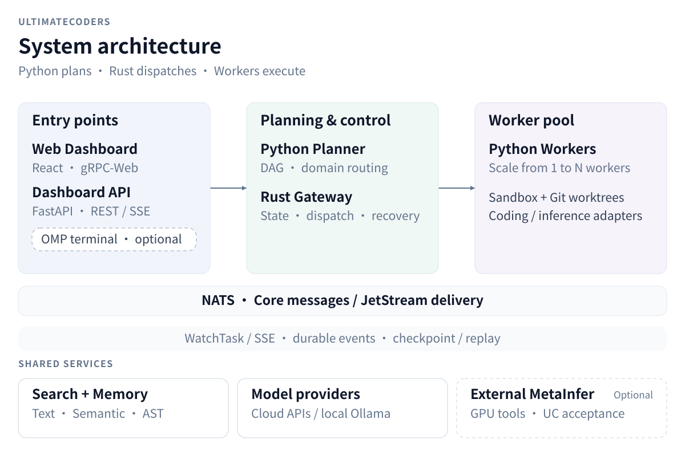
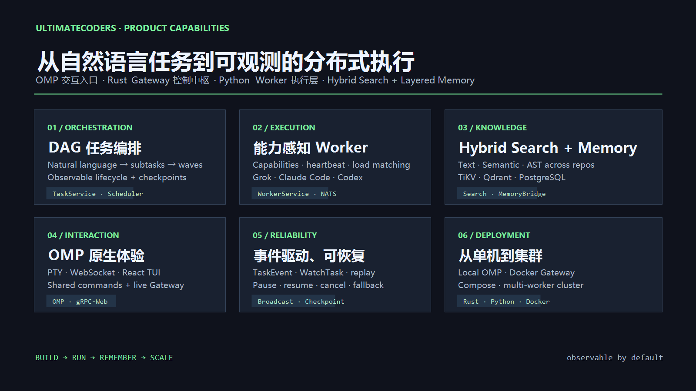
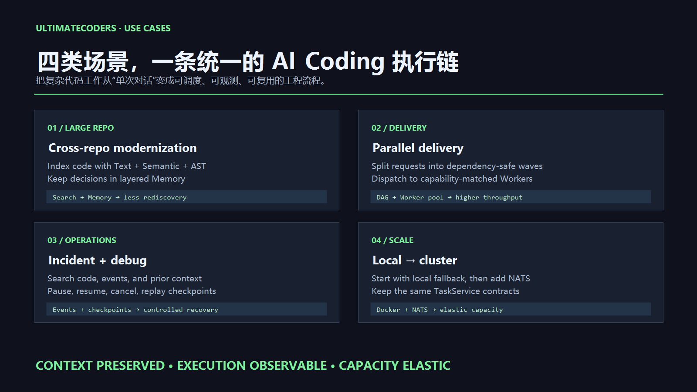

# UltimateCoders

[English](README.md) | [简体中文](README.zh-CN.md)

[](https://github.com/JameryW/UltimateCoders/actions/workflows/ci-rust.yml)
[](https://github.com/JameryW/UltimateCoders/actions/workflows/ci-python.yml)
[](#license)

Distributed AI coding system with shared layered memory and multi-repository hybrid retrieval across text, semantic, and AST indexes.

The default Docker app uses the Web Dashboard, Rust Gateway, NATS, and Python Workers. The optional oh-my-pi (OMP) extension remains available through `run-omp.sh` for native terminal workflows. The Python Worker/Sandbox defaults to the [xAI Grok Build](https://github.com/xai-org/grok-build) coding agent (`grok`); Claude Code, Codex, OpenCode, oh-my-pi, MiMo Code, and the local harness are supported adapters. The three MiMo-backed adapters select MiMo V2.6 Flash; OMP alone has native DeepSeek Flash fallback. The Rust core handles indexing, search, memory, and scheduling, while a broadcast channel delivers live task events to Dashboard and API consumers.

## Key Features

- **DAG orchestration**: decompose natural-language tasks into observable nodes, dispatch each node when its dependencies complete, and stream lifecycle events.
- **Product home and operations dashboard**: `/` explains capabilities and the execution path; `/dashboard` and `#/dashboard` provide live operations.
- **Optional OMP extension**: `run-omp.sh` provides native `/uc` commands and LLM-callable tools outside the default Docker app.
- **Distributed workers**: workers register through `WorkerService`, publish heartbeats and capabilities, and receive capability- and load-aware dispatch from the Gateway; NATS carries cross-process subtasks.
- **Rust core**: Engine, Task, Dashboard, and Worker services expose unified gRPC/gRPC-Web interfaces with task recovery, event broadcast, and in-memory fallback.
- **Cross-repository hybrid retrieval**: one query can combine text, semantic, and AST retrieval across indexed Git repositories.
- **Layered memory**: short-term memory, long-term semantic memory, and structured metadata use TiKV, Qdrant, and PostgreSQL, with an in-memory fallback when dependencies are unavailable.
- **Inference infrastructure**: an optional MetaInfer backend provides model porting, kernel/runtime tools and trace analysis; fixed benchmarks, Oracle acceptance, iterative rollback and execution/adaptation graphs connect results to shared memory.
- **Flexible deployment**: run local OMP, a Docker Gateway, Docker Compose, or a multi-worker cluster; workers can use Grok Build, Claude Code, Codex, OpenCode, oh-my-pi, MiMo Code, or the local harness.

## Product Highlights

UltimateCoders turns terminal-based AI coding into an observable, schedulable execution platform:

| Capability | What it shows | User benefit |
| --- | --- | --- |
| Product dashboard home | Runtime Surface, product map, workflow, and use cases | Understand the product and enter a real execution path from one place |
| Product map | Command, Control, Execution, Knowledge, and Event layers | See how entry points, orchestration, workers, context, and results connect |
| DAG orchestration | Planners build the DAG; the Rust Gateway dispatches ready nodes | Break down, track, and recover complex work |
| Unified control plane | Dashboard and gRPC TaskService share task state | Keep task state consistent across entry points |
| Distributed workers | Registration, capabilities, heartbeats, and load-aware scheduling | Scale execution capacity around model and tool capabilities |
| Search and memory | Text + Semantic + AST retrieval with TiKV/Qdrant/PostgreSQL memory | Give coding agents reusable context across repositories |
| Inference infrastructure | InfraAgent, MetaInfer tools, Benchmark/Oracle and adaptation graphs | Accept measured improvements and retain reusable engineering evidence |
| Reliable deployment | Rust Gateway, NATS, Docker, in-memory fallback, and task events | Move from a local workflow to a worker cluster without changing the product surface |

## Quick Start

### 1. Install prerequisites

- Rust 1.75+ (stable)
- Python 3.9+
- Bun (only for the optional OMP extension)
- [Grok Build CLI](https://docs.x.ai/build/overview) (default worker executor)
- Docker Compose (for the default app and its storage services)

Install Grok Build and provide an xAI API key for the default worker:

```bash
curl -fsSL https://x.ai/cli/install.sh | bash
export XAI_API_KEY=your-key
```

### 2. Start the local workflow

```bash
git clone https://github.com/JameryW/UltimateCoders.git
cd UltimateCoders
docker compose -f docker/docker-compose.yml -f docker/docker-compose.local.yml --profile app up --build
```

The Compose app starts the Gateway, Dashboard API and UI, NATS, storage, and Workers. The optional OMP extension can be started separately with `./run-omp.sh`.

The browser entry points are:

| Entry point | Use |
| --- | --- |
| `http://localhost:8081/` | Product home: capabilities and execution path |
| `http://localhost:8081/dashboard` or `http://localhost:8081/#/dashboard` | Operations dashboard: tasks, workers, events, scheduler, search, files, and metrics |

Optional OMP commands:

```text
/uc submit <description>    Submit a task
/uc status                  Show task status
/uc pause <task-id>         Pause a task
/uc resume <task-id>        Resume a task
/uc cancel <task-id>        Cancel a task
```

### 3. Start other modes

```bash
# Distributed cluster: NATS + gRPC + multiple workers + optional OMP
./run-cluster.sh --workers 2

# Standalone Gateway: in-memory fallback or external storage
./run-gateway.sh up

# Gateway + local storage containers
./run-gateway.sh up --docker
```

For build, test, configuration, and external Git deployment details, see [Building](#building), [Configuration](#configuration), and [Distributed Worker + External Git Deployment](#distributed-worker--external-git-deployment).

## Technical Architecture

The architecture separates task planning, execution authority, coding execution, and inference acceptance. The default Compose app runs the Dashboard UI/API, Rust Gateway, a Python planning coordinator, NATS, and a scalable Worker Pool. The native OMP extension is an optional entry point.



[Full-size overview](docs/screenshots/architecture-overview.svg) · [Mobile view](docs/screenshots/architecture-overview-mobile.svg) · [Protocols and acceptance workflow](docs/architecture.md#system-architecture)

The three columns summarize entry points, planning/control, and distributed execution. Arrows summarize the task flow; dashed outlines mark optional integrations. The architecture reference shows the individual protocol routes and UC's inference acceptance workflow.

The default task path is **submit → plan the DAG → dispatch ready nodes → execute → report → release dependent nodes**. Python plans and routes domains; the Rust Gateway owns task controls and dispatch (`UC_GATEWAY_OWNS_DISPATCH=true` in Compose). Completing a node can release its dependents immediately, without waiting for an entire wave.

| Layer | Components | Responsibility |
| --- | --- | --- |
| Interaction | Web Dashboard, Dashboard API; optional native OMP | Browser gRPC-Web, REST/SSE, and terminal `/uc` entry points |
| Planning | Python coordinator; optional OMP planner | Decompose tasks, validate dependencies, route inference tasks, and preserve execution configuration |
| Control plane | Rust Gateway, TaskStore, WorkerRegistry | Task state, ready-node dispatch, capability/project/version gates, placement, controls and recovery |
| Execution | NATS JetStream, Python Workers, Sandbox/worktrees | Deliver execution envelopes and run coding adapters or inference workflows |
| Knowledge | Search + Memory | Combine Text, Semantic, and AST retrieval with TiKV, Qdrant, and PostgreSQL memory |
| Acceptance | BenchmarkRunner, Oracle, optimization workflow | Measure fixed workloads, reject/roll back candidates, and retain accepted evidence |
| Observability | Task events, WatchTask, Dashboard API/SSE | Live progress, ordered durable history, checkpoint/replay and metrics |

The durable-runtime design uses Graph → Node → Attempt identities, leases/fencing and commit-once results. The current Gateway still serves its TaskStore projection; PostgreSQL graph writes and graph-backed attempt operations require `UC_DATABASE_URL` plus `UC_GRAPH_SHADOW=on`. Default Compose configures PostgreSQL task persistence and NATS event history, but leaves graph shadow mode off. The inference **adaptation graph** records experiment provenance and evidence; it is distinct from the execution graph used for scheduling.

MetaInfer is an external execution backend. UC owns the assigned worktree, benchmark protection, Oracle policy, cancellation and acceptance; GPU allocation and specialized generation belong to the service. Local Ollama supplies model inference through compatible planning/coding adapters, while MetaInfer supplies specialized engineering tools. See [the architecture reference](docs/architecture.md) for boundaries and deployment modes.

## Inference Infrastructure (MetaInfer)

UltimateCoders keeps global planning, dispatch, worktree ownership and acceptance. The optional `InferenceInfraAgent` delegates specialized execution to an external MetaInfer service. Its tools live in `ultimate_coders.inference`; no MetaInfer source or GPU library is required in the UC Worker image.

| Operation | Execution backend | Purpose |
| --- | --- | --- |
| `port_model` | MetaInfer `port-model` | Port a model into the assigned framework worktree |
| `optimize_kernel` | MetaInfer `evolve-kernel` | Generate and evaluate kernel candidates |
| `optimize_runtime` | MetaInfer `gen-infer-framework` by default | Generate a purpose-built runtime; existing-framework optimization requires a suitable `upstream_type` plugin |
| `analyze_trace` | MetaInfer `sglang-trace-analyze` | Collect runtime analysis and evidence |
| `benchmark` | UC `BenchmarkRunner` | Measure a fixed workload locally without a MetaInfer service |

Set the service URL on the planner and eligible workers, or in `docker/.env` for Compose:

```dotenv
UC_METAINFER_URL=http://metainfer-host:8765
UC_METAINFER_REVISION=b3f6505a11ab704ee1cfb68e9c1b2c13c95ac890
UC_METAINFER_BACKEND_ID=metainfer-gpu-a
```

Mutating MetaInfer work requires the UC service contract (`uc-metainfer/1`):
the service must advertise the pinned revision, a stable backend identity,
workspace probes and all-writer quiescence evidence. The stock upstream server
at the pinned commit does not expose that contract, so UC refuses mutating
requests until a compatible companion/extension is deployed. Read-only schema
probes may still be used for capability discovery.

Workers advertise local `inference_benchmark` without MetaInfer. Remote tasks require `inference_infra` plus the operation capability confirmed by live plugin probes; heartbeat refresh withdraws unhealthy capabilities. Automatic routing requires inference context and engineering intent, and explicit agent choices take priority.

Submit `agent_config.inference_task` through the Dashboard submit API or Python Orchestrator, or select the `metainfer` adapter in a workflow step. Service tasks need actual plugin parameters; optimization and local measurement also require benchmark configuration. Prose does not supply model paths or GPU availability. Optional `UC_INFERENCE_TASK_JSON` provides defaults for natural-language routing.

The optimization workflow measures a baseline, requests a candidate, compiles/benchmarks/profiles it, and uses the shared Oracle to check correctness, performance and memory/error limits. It keeps improvements and restores rejected candidates before the next iteration. Protect the benchmark harness with `protected_paths`; use an explicit argv `apply_command` when generated output must be imported from the service workspace.

UC and MetaInfer must share the assigned worktree at the same absolute path. Mutating tasks require an exclusive real Git worktree. PostgreSQL runtime records preserve remote-job identity, checkpoints and terminal outbox; uncertain submission or termination quarantines the workspace. UC commits accepted edits before merge and retains failed delivery for recovery. Atomic manifests and integrity-checked artifacts are available through authenticated Dashboard API routes. See [reliability verification](docs/metainfer-reliability-verification.md).

Validation snapshot (2026-09-30): the production Docker app now runs locally. Real Ollama distributed coding, GPU chat benchmarking with an immutable Oracle, storage, task controls and recovery were exercised. External MetaInfer optimization remains unconfigured. See the [local deployment verification report](docs/local-deployment-verification.md) for evidence, reproducible commands and limitations.

See [the inference infrastructure guide](docs/inference-infra.md) for a complete task example, live-schema requirements, benchmark output, Oracle policy and deployment/cancellation limits.

## Product Preview

The product home (`/`) explains capabilities and the execution path. The operations dashboard (`#/dashboard`) is the live monitoring and task control surface.

### Dashboard home and live entry points

The product home is the navigation layer between product understanding and real execution:

- **Runtime Surface**: show Gateway status, version, task count, and WatchTask state through the existing gRPC-Web connection.
- **Product Map**: explain the responsibilities, protocols, and benefits of the Web, Control, Execution, Knowledge, and Event planes.
- **Live handoff**: open `#/dashboard` to submit tasks and inspect the real Gateway state.

Local Vite preview: `http://127.0.0.1:4176/`; operations dashboard: `http://127.0.0.1:4176/#/dashboard`.

### Product capabilities



This overview covers DAG orchestration, capability-aware workers, Hybrid Search + Memory, event-driven recovery, and the path from a local workflow to a cluster.

### Product use cases



UltimateCoders targets large-repository changes, parallel delivery, incident diagnosis, and local-to-cluster expansion. The recurring benefits are reusable context, observable execution, and scalable capacity.

## Runtime and architecture

The product dashboard (Vite + React) is available at `http://localhost:8081/` in Docker and `http://localhost:5173/` in development. Its root route is the product overview; the operations dashboard is at `/dashboard` or `#/dashboard`.

See [docs/architecture.md](docs/architecture.md) for the detailed architecture reference. The runtime can be read in five layers:

| Layer | Responsibility | Main interfaces |
| --- | --- | --- |
| Command | Dashboard UI/API and optional native OMP | gRPC-Web, REST/SSE, `/uc` |
| Control | Planning coordinator plus Rust task lifecycle, ready-node scheduling and persistence | Orchestrator, TaskService, TaskStore, execution envelopes |
| Execution | Capability-aware Workers, coding adapters and optional inference workflows | WorkerService, NATS JetStream, Sandbox/worktrees, MetaInfer HTTP |
| Knowledge | Repository indexing, hybrid search and layered memory | Text, Semantic, AST, TiKV, Qdrant, PostgreSQL |
| Events | Live progress, recovery and monitoring updates | TaskEvent, ordered EventStore, checkpoint/replay, SSE, WatchTask |


### Real-Time Event Flow

1. The planning coordinator publishes complete DAG/configuration snapshots; Workers publish partial results and progress over NATS. Partial reports cannot replace parent controls or execution configuration.
2. The Gateway applies state changes and records their events under the same TaskStore lock. Its broadcast channel feeds `WatchTask`; the Dashboard API independently consumes NATS for SSE and metrics.
3. The EventStore preserves recording order. Checkpoint/recovery waits for preceding writes, then replays the complete history; failed writes surface as recovery errors.
4. Compose uses `UC_EVENT_BACKEND=nats` for durable JetStream history. The in-memory backend and checkpoint snapshot cache are transient; durable history supports replay after restart.

### OMP Extension Internals

The UC Orchestrator extension (`packages/uc-orchestrator`) is an optional native terminal interface. It plans tasks and can claim unassigned nodes for local execution; task controls and execution ordering go through the Rust Gateway. Key components:

| Component | File | Role |
|-----------|------|------|
| **Extension entry** | `extension.ts` | Registers `/uc` command, shortcuts, message renderer, wires events → UI |
| **Orchestrator** | `orchestrator.ts` | Plan/validate DAG → upsert to Gateway → claim/execute/report → observe completion |
| **Scheduler** | `scheduler.ts` | DAG validation, file-conflict helpers and CircuitBreaker |
| **GrpcBridge** | `grpc-bridge.ts` | gRPC client for TaskService (submit, watch, control signals) |
| **MemoryBridge** | `memory-bridge.ts` | LLM-callable tool: `uc_memory` (read/write/search/delete) |
| **TaskBridge** | `task-bridge.ts` | LLM-callable tool: `uc_task` (submit/cancel/pause/resume/status) |
| **IndexBridge** | `index-bridge.ts` | LLM-callable tool: `uc_index` (index_repo/list_repos/get_state/remove_index) |
| **FileBridge** | `file-bridge.ts` | LLM-callable tool: `uc_file` (list_dir/get_file) |
| **WorkerBridge** | `worker-bridge.ts` | LLM-callable tool: `uc_worker` (list/status/scale/deregister) |
| **TaskStore** | `task-store.ts` | Local JSON UI projection cache; refreshed from Rust task state |
| **ControlSignals** | `control-signal-subscriber.ts` | gRPC stream for pause/resume/cancel from external sources |
| **Events** | `events.ts` | Typed event emitter decoupling orchestration ↔ UI |

Agent definition prompts (`agents/decomposer.md`, `supervisor.md`, `worker.md`) configure the LLM roles for task decomposition, subtask review, and code generation.

### Local Fallback (No NATS)

Storage fallback and execution fallback have separate contracts. A Gateway can serve its APIs with in-memory storage; this does not provide a coding executor. The executor selector allows local execution only for `read_only`/`local_safe` nodes with a configured local handler. Coding nodes require a capable executor and remain queued when transport/capacity is unavailable. The optional OMP claim loop can execute claimed nodes locally and report through the Gateway. A standalone Gateway without a planner or executor does not automatically decompose and complete coding tasks.

### NATS Worker

The same Python module has two deployment roles:

| Compose service | Mode | Responsibility |
| --- | --- | --- |
| `nats-worker` | Default coordinator mode | Subscribe to `uc.task.submit`, run Orchestrator planning/domain routing, and publish complete task snapshots; Compose delegates dispatch to Rust |
| `worker` | `--mode worker` | Register/heartbeat through WorkerService, consume JetStream execution envelopes, run Worker/Sandbox adapters, and publish partial results/events |

Workers advertise capabilities only when available and carry the Gateway's contract version. A mismatched worker is refused; missing capability, project scope or current-version capacity keeps the node pending. Planning-model configuration remains separate from coding-adapter selection.

The worker invokes `grok -p ... --output-format streaming-json` by default. Set
`UC_CODING_AGENT` to `opencode`, `oh-my-pi` (`omp` alias), or `mimo-code`
(`mimo` alias) to use one of the MiMo-backed CLIs. Each selects MiMo V2.6
Flash; only oh-my-pi enables its native DeepSeek V4 Flash fallback chain.
OpenCode and MiMo Code do not switch models on provider failures. These are
Worker adapters and do not replace the optional local OMP extension launched
by `run-omp.sh`. OpenCode uses a task-scoped HOME/XDG config and private
standalone server; V2 also merges project config found in the worktree or its
ancestors, which may override matching provider or permission values. The
worker logs a warning when it finds those config files. OMP fails closed for
empty or unrecognized explicit tool allowlists, limits MCP access to selected
servers when configured with `mcp__server__*`, and skips a server when it
cannot enforce an individual MCP-tool rule.

For a smaller local OpenAI-compatible model use `UC_CODING_AGENT=local-harness`,
or select `claude-code` / `codex` when a deployment uses those CLIs. The
orchestrator's task-planning model remains configured separately with
`UC_LLM_PROVIDER`, `UC_LLM_MODEL`, and related `UC_LLM_*` variables.

### Multi-Worker Distributed Architecture

Multiple worker processes execute independent ready nodes from one DAG:

- **Durable delivery**: Gateway-provisioned `UC_SUBTASKS` JetStream consumers acknowledge attempts and support redelivery. Delivery is not an exactly-once guarantee; execution envelopes carry graph/node/attempt IDs, idempotency keys, worker epochs and contract versions.
- **Placement**: capability, project scope and contract version are hard gates. Default affinity prefers recent file overlap; opt-in `UC_PLACEMENT_POLICY=capacity` ranks eligible dedicated workers by load/capacity. Shared delivery remains overflow.
- **Attempt safety**: the enabled PostgreSQL graph path claims/renews leases, fences expired attempts and commits a terminal result once; late results cannot replace a committed completion.
- **Conflict resolution**: file-overlap hints reduce collisions; opt-in external Git delivery uses isolated worktrees and merge-time arbitration, with Rust fenced authorization for the graph-backed merge barrier.
- **Event-driven scheduling**: accepted results release dependent nodes through the Gateway; pause/resume/cancel use the same control authority. Explicit review requires an opted-in `review` worker and a structured verdict; strict independent delivery is not guaranteed by shared overflow.

### Repository Structure

| Path | Purpose |
| --- | --- |
| `crates/` | Rust core, Engine API, gRPC services and PyO3 binding |
| `packages/uc-orchestrator/` | OMP extension, DAG orchestration, UC tools and terminal UI |
| `python/ultimate_coders/` | Python Engine facade, Worker/Sandbox, search, memory and FastAPI dashboard |
| `python/ultimate_coders/inference/` | MetaInfer adapter, InfraAgent routing, benchmarks, Oracle, optimization workflow and adaptation graphs |
| `dashboard/` | Vite + React product homepage and operations dashboard |
| `docker/` | Gateway, Worker, storage and compose configuration |
| `tests/python/` | Python unit tests |
| `run-omp.sh`, `run-cluster.sh`, `run-gateway.sh` | Local, clustered and standalone startup entry points |

## Building

### Rust

```bash
cargo check                    # Check all crates compile
cargo test                     # Run all tests (in-memory fallbacks)
cargo test --features storage  # Run tests with real storage backends
cargo test --features indexing # Run tests with AST indexing enabled
cargo clippy --workspace       # Lint
cargo fmt --all -- --check     # Format check
```

The `uc-grpc-server` gateway enables the scheduler runtime by default, so
the standard launcher and Docker builds execute jobs declared in
`uc.scheduler.yaml`. The lower-level `uc-engine` library keeps scheduler
support feature-gated for consumers that do not need runtime scheduling.

### Python

```bash
python -m pip install -e ".[test]"
pytest tests/python/ -v        # Run Python tests
```

### UC Orchestrator

```bash
# Start OMP with UC extension (gRPC server starts by default)
./run-omp.sh

# Skip gRPC server
./run-omp.sh --no-server

# Ensure Python package is built first
./run-omp.sh --build

# Standalone: gateway runs in a container (in-memory/external-storage fallback)
./run-omp.sh --standalone
# Standalone + local storage containers
./run-omp.sh --standalone --docker

# Start distributed cluster instead
./run-cluster.sh
# Standalone cluster: container gateway + storage + host workers
./run-cluster.sh --standalone --workers 2
```

### Standalone Gateway (containerized)

```bash
# Gateway container only — in-memory fallback, or external storage via env
./run-gateway.sh up
# Gateway + local storage containers (TiKV/Qdrant/PG/NATS)
./run-gateway.sh up --docker
# Status / logs / stop
./run-gateway.sh status
./run-gateway.sh logs
./run-gateway.sh down [--docker]

# External storage (default mode, no --docker): point at remote backends,
# empty = in-memory fallback.
#   UC_TIKV_PD_ENDPOINTS=pd.example:2379 UC_QDRANT_URL=http://qdrant.example:6334 \
#     UC_PG_URL=postgresql://u:p@pg.example:5432/uc UC_NATS_URL=nats://nats.example:4222 \
#     ./run-gateway.sh up
```

### Docker Compose (storage backends)

```bash
# Build and start the complete local app against this checkout, including
# the React Dashboard UI and a writable Git workspace for workers.
docker compose -f docker/docker-compose.yml -f docker/docker-compose.local.yml --profile app up --build
# React UI: http://localhost:8081
# Dashboard API: http://localhost:8080/dashboard/

# Start all storage backends
docker compose -f docker/docker-compose.yml up -d

# Stop everything
docker compose -f docker/docker-compose.yml down

# Stop and remove volumes
docker compose -f docker/docker-compose.yml down -v
```

For external Git workers (`UC_REPO_URL` set), use only the base compose file:
their `/workspace` stays on the persistent `worker_workspace` volume. The
local override bind-mounts this checkout at `/workspace` for both Python
services and configures Git's `safe.directory` for that mount and its generated
worktrees on Docker Desktop. Do not combine it with external Git sync.

For a real coding task, start the configured LLM service before submitting.
With Ollama on the Docker host, `ollama serve` must be reachable at
`host.docker.internal:11434` from the workers, and `UC_OPENROUTER_MODEL`
must name an installed Ollama model when Codex uses the local provider.
The Gateway's storage health check does not test model generation.

### Distributed Worker + External Git Deployment

Workers can run containerized and sync code from an **external git remote**
(GitHub/GitLab), making the remote the unified source of truth across hosts.
This is **opt-in**: without `UC_REPO_URL` the legacy local-only workspace
mode is used.

**Configuration** (set on the `worker` / `nats-worker` services):

| Variable | Default | Description |
|----------|---------|-------------|
| `UC_REPO_URL` | _(empty)_ | External git remote URL. Empty = local-only workspace. |
| `UC_REPO_BASE_BRANCH` | `main` | Base branch workers branch off; the arbiter merges into it. |
| `UC_GIT_TOKEN` | _(empty)_ | PAT, injected via `GIT_ASKPASS` (never on the URL/args). |
| `UC_GIT_FETCH_ON_ACQUIRE` | `true` | `git fetch` before each worktree acquire. |
| `UC_GIT_PUSH_ON_RELEASE` | `false` | Push the `uc/subtask/<id>` branch on release. |
| `UC_GIT_MERGE_ARBITRATE` | _(env)_ | Orchestrator `MergeArbiter` merges subtask branches into `origin/main` and pushes. |

**Flow:**

1. Each worker clones `UC_REPO_URL` into a persistent volume on first start.
2. Each subtask runs in a git worktree branched off `origin/<base_branch>`.
3. On release, the worker pushes `uc/subtask/<id>` (workers never touch `main`).
4. The Orchestrator's `MergeArbiter` merges subtask branches into `origin/main`
   and pushes `main` (the only writer of `main`).

**Conflict model:** `DistributedConflictDetector` is an advisory in-process
scheduling hint, NOT a distributed lock. The authoritative cross-worker
conflict point is git merge-time (`MergeArbiter`).

**Cross-host scaling:** `docker compose --scale worker=N` scales workers on
the **same host** only (the gateway shells out to the local `docker.sock`).
True cross-host scaling requires docker swarm / a remote docker context /
per-host gateways (future work). The external-git design is already
cross-host-safe at the data level: each host runs its own compose and clones
from the same remote, and merge arbitration reconciles concurrent edits.

## CI

Eleven independent workflows are defined. Ten run on pushes and pull requests targeting `main`; `metainfer-release-gate.yml` is manual-only. All but `ci-scripts.yml` and the manual gate are path-filtered, so they only run when one of the listed paths changes; the workflow files themselves are the source of truth:

| Workflow | Trigger paths | Checks |
|----------|--------------|--------|
| **Rust CI** (`ci-rust.yml`) | `crates/**`, `Cargo.toml`, `Cargo.lock`, `docker/docker-compose.yml` | check, clippy, fmt, test (3 feature combos), postgres integration |
| **Python CI** (`ci-python.yml`) | `python/**`, `tests/**`, `pyproject.toml`, `dashboard/**`, `crates/uc-python/**`, `crates/uc-types/**`, `crates/uc-engine/**`, `crates/uc-grpc/**`, `Cargo.toml`, `Cargo.lock` | ruff lint, dashboard build, pytest (3.9 + 3.12) |
| **Dashboard CI** (`ci-dashboard.yml`) | `dashboard/**` | typecheck, build |
| **TypeScript CI** (`ci-typescript.yml`) | `packages/uc-orchestrator/**`, `vendor/oh-my-pi/packages/mnemopi/**`, `vendor/oh-my-pi/packages/coding-agent/**` | `bun test` for each package |
| **Scripts CI** (`ci-scripts.yml`) | *(no paths filter)* | spec-refs, tasks-refs, ruff lint |
| **Trellis CI** (`ci-trellis.yml`) | `.trellis/scripts/**`, `tests/python/test_task_finish_fallback.py`, `tests/python/test_archive_repoints_refs.py` | framework-scripts tests |
| **Journal CI** (`ci-journal.yml`) | `.trellis/workspace/**`, `.trellis/scripts/add_session.py`, `scripts/check-journal-ledger.py`, `tests/python/test_check_journal_ledger.py` | journal-ledger check + tests |
| **Codex Issue-Flow CI** (`ci-codex-flow.yml`) | `.agents/skills/**`, `AGENTS.md`, `docs/agents/domain.md`, `docs/agents/issue-tracker.md`, `docs/agents/mattpocock-skills.md`, `docs/agents/triage-labels.md`, `docs/workflows/codex-issue-flow.md`, `scripts/check-codex-issue-flow.py` | issue-workflow wiring validation |
| **README CI Table CI** (`ci-readme-ci-table.yml`) | `README.md`, `README.zh-CN.md`, `.github/workflows/**`, `scripts/check-readme-ci-table.py`, `tests/python/test_check_readme_ci_table.py` | reconciles this table against the workflow YAML |
| **Workflow Inputs CI** (`ci-workflow-inputs.yml`) | `.github/workflows/**`, `scripts/check-workflow-inputs.py`, `tests/python/test_check_workflow_inputs.py` | checks that every file a workflow's `run:` steps name is covered by its `paths` |
| **MetaInfer Release Gate** (`metainfer-release-gate.yml`) | *(no paths filter; manual dispatch only)* | pinned MetaInfer service contract, shared-workspace preflight and GPU identity evidence gate |

Every path-filtered workflow's own YAML file also matches its `paths` (named directly, or through `.github/workflows/**`), so editing a workflow re-runs it, and every workflow supports manual dispatch. The PostgreSQL-backed suite runs on every PR; storage integration tests only run on `main` pushes or manual dispatch (requires Docker Compose infra).

## Configuration

Configuration is loaded from environment variables with sensible defaults. No config file required for development.

| Variable | Default | Description |
|----------|---------|-------------|
| `UC_ENGINE_MODE` | `local` | Engine mode: `local` (PyO3 FFI) or `grpc` (remote) |
| `UC_GRPC_ADDR` | `[::]:50051` | gRPC server listen address |
| `UC_GRPC_ENDPOINT` | - | gRPC server endpoint (required for grpc mode) |
| `UC_TIKV_PD_ENDPOINTS` | `127.0.0.1:2379` | TiKV Placement Driver endpoints (comma-separated) |
| `UC_QDRANT_URL` | `http://127.0.0.1:6333` | Qdrant REST API URL |
| `UC_QDRANT_API_KEY` | - | Qdrant API key (optional) |
| `UC_POSTGRES_URL` | `postgresql://localhost:5432/ultimatecoders` | PostgreSQL connection URL |
| `UC_NATS_URL` | `nats://127.0.0.1:4222` | NATS server URL |
| `UC_PROJECT_PATH` | - | Project path for sandbox execution |
| `UC_CODING_AGENT` | `grok-build` | Worker coding agent: `grok-build`/`grok`, `claude-code`, `codex`, `opencode`, `oh-my-pi`/`omp`, `mimo-code`/`mimo`, `deepseek-harness`, or `local-harness` |
| `UC_METAINFER_URL` | _(empty)_ | Optional external MetaInfer service; enables inference capabilities and automatic domain routing |
| `UC_INFERENCE_TASK_JSON` | _(empty)_ | JSON `agent_config` defaults for inference experiments and natural-language routing |
| `UC_INFERENCE_ARTIFACT_DIR` | `.uc-inference-artifacts` beside the assigned repository | Native experiment artifact root; Compose sets `/artifacts/inference` on a persistent volume |
| `UC_DATABASE_URL` | PostgreSQL in Compose | Shared Gateway/coordinator/Worker/API runtime database |
| `UC_RUNTIME_STATE_DIR` | `.uc/runtime` | Local SQLite when no database URL is set; keep outside candidate worktrees |
| `UC_METAINFER_MAX_CONCURRENCY` | `1` | Shared concurrent-job limit for one backend |
| `UC_METAINFER_TASK_TYPES` | Default plugins | JSON operation-to-plugin map shared by probing and execution |
| `UC_METAINFER_REVISION` | _(empty)_ | Expected immutable MetaInfer service revision for mutating work |
| `UC_METAINFER_BACKEND_ID` | URL hash | Stable service identity shared by all workers and recovery tools |
| `UC_OUTBOX_RETENTION_SECONDS` | `604800` | How long delivered terminal outcomes remain before compact tombstoning |
| `XAI_API_KEY` | - | xAI API key for the default Grok Build worker agent |
| `ANTHROPIC_API_KEY` | - | Anthropic API key for Claude Code calls |
| `OPENAI_API_KEY` | - | OpenAI API key for Codex calls |
| `MIMO_API_KEY` | - | MiMo Platform key for OpenCode, MiMo Code, and optionally task planning via `UC_LLM_*` |
| `XIAOMI_API_KEY` | - | MiMo key for OMP's Xiaomi provider; OMP can also use `MIMO_API_KEY` |
| `DEEPSEEK_API_KEY` | - | DeepSeek V4 Flash fallback for OMP; the other two MiMo-backed CLIs have no native model failover |
| `UC_CODEX_OPENROUTER` | `false` | Enable OpenRouter as the Codex CLI provider (requires `UC_CODING_AGENT=codex`) |
| `UC_OPENROUTER_MODEL` | `stealth/ox-alpha` | OpenRouter model slug used by the opt-in Codex provider |
| `UC_CODEX_WEB_SEARCH` | `disabled` | Codex native web-search mode; keep `disabled` for `stealth/ox-alpha`, which rejects that OpenAI-specific tool |
| `UC_OPENROUTER_REASONING_EFFORT` | `low` | Codex reasoning effort; `stealth/ox-alpha` requires reasoning to be enabled |
| `OPENROUTER_API_KEY` | - | OpenRouter API key used by the opt-in Codex provider |
| `UC_SANDBOX_ENV_EXTRA` | - | Extra env vars passed to agent subprocesses, comma-separated (`*` suffix = prefix match). Agent subprocesses get a deny-by-default allowlist — only base system vars, `UC_*`, proxy vars, and the per-agent credentials listed above are inherited from the host environment. Use this to widen the list; it is logged at worker startup. |

Docker Compose default credentials:

| Service | Host | Port | User | Password |
|---------|------|------|------|----------|
| PostgreSQL | localhost | 5432 | `ultimate_coders` | `ultimate_coders` |
| Qdrant REST | localhost | 6333 | - | - |
| Qdrant gRPC | localhost | 6334 | - | - |
| TiKV PD | localhost | 2379 | - | - |
| NATS | localhost | 4222 | - | - |
| NATS Monitor | localhost | 8222 | - | - |

## Development

### Running Tests

```bash
# Rust unit tests (no storage required)
cargo test --no-default-features

# Rust tests with indexing feature
cargo test --features indexing

# Rust tests with real storage (requires Docker Compose)
cargo test --features storage

# Python tests and runtime dependencies
python -m pip install -e ".[test]"
pytest tests/python/ -v

# Python tests with Rust extension
python -m pip install -e ".[test]" && pytest tests/python/ -v

# UC Orchestrator tests
cd packages/uc-orchestrator && npx tsc --noEmit
```

### Linting

```bash
# Rust
cargo clippy --workspace -- -D warnings
cargo fmt --all -- --check

# Python
ruff check python/ tests/ scripts/

# UC Orchestrator
cd packages/uc-orchestrator && npx tsc --noEmit
```

## License

MIT
