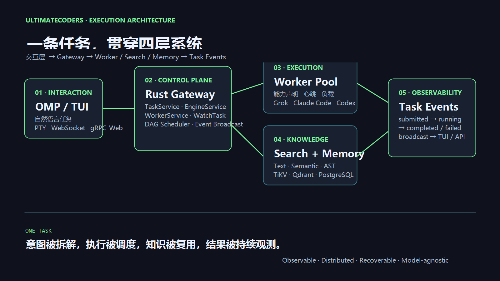
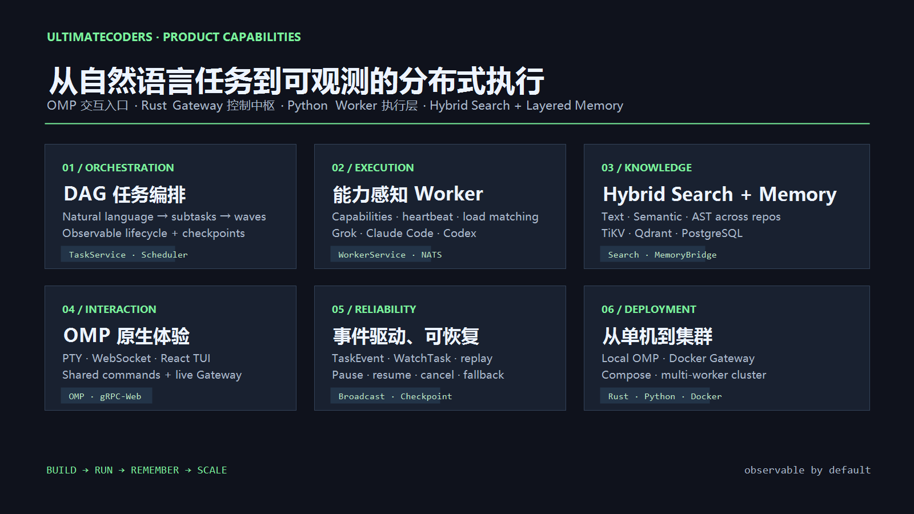
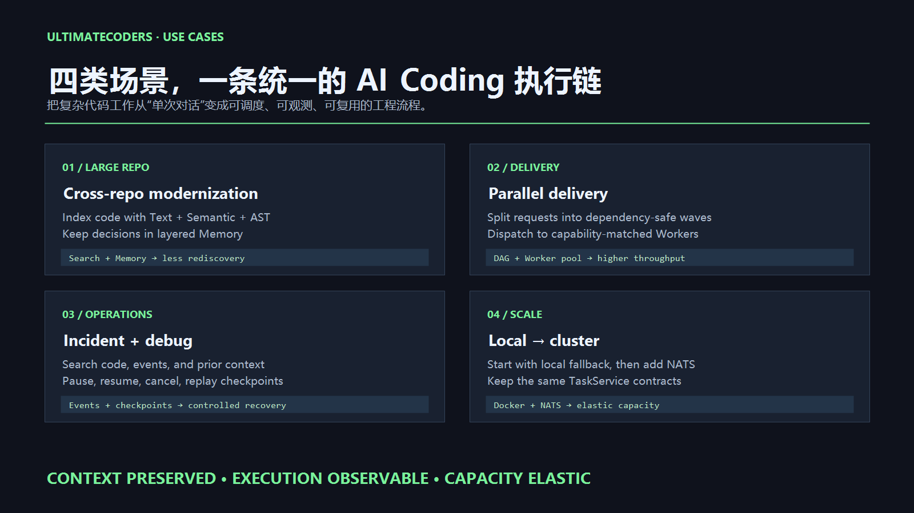
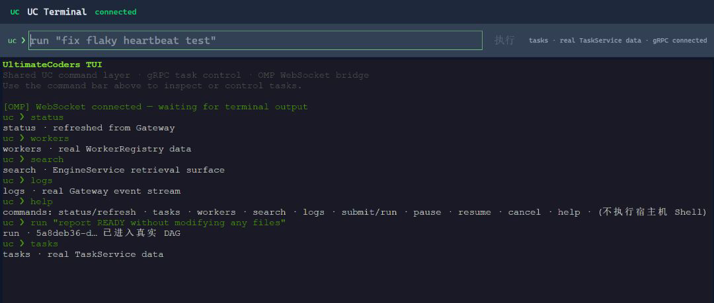
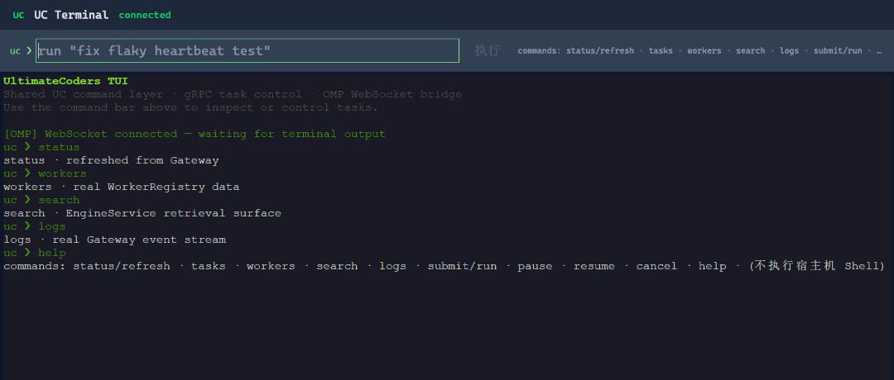
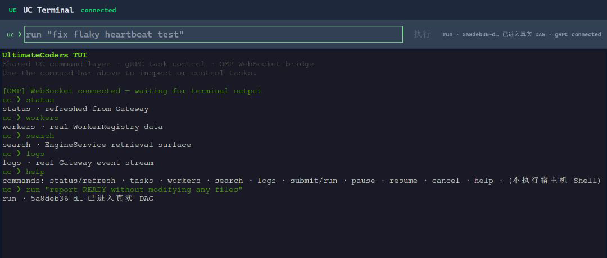

# UltimateCoders

[English](README.md) | [简体中文](README.zh-CN.md)

[](https://github.com/JameryW/UltimateCoders/actions/workflows/ci-rust.yml)
[](https://github.com/JameryW/UltimateCoders/actions/workflows/ci-python.yml)
[](LICENSE)

UltimateCoders 是一个分布式 AI 编程系统，提供共享分层记忆，以及跨多个仓库的 Text、Semantic、AST 混合检索。

UC Orchestrator 以 oh-my-pi（OMP）扩展运行，提供终端任务交互、子任务进度组件、覆盖层、自定义消息渲染和可由 LLM 调用的记忆工具。Python Worker/Sandbox 默认使用 [xAI Grok Build](https://github.com/xai-org/grok-build) 终端编程 Agent（`grok`）执行子任务，也支持 Claude Code 和 Codex 适配器。OMP 的本地 `runSubprocess` 路径仍负责自身的任务拆解和执行；Rust 核心负责索引、检索、记忆和调度，并通过广播通道向 TUI 和 API 消费者推送实时任务事件。

## 核心特性

- **DAG 任务编排**：将自然语言任务拆解为可观测子任务，按依赖关系分波次调度，并持续推送 submitted、running、completed、failed 状态。
- **产品首页、运营 Dashboard 和 TUI**：`/` 展示产品能力和执行链；现有运营 Dashboard 保留在 `/dashboard`（同时兼容 `#/dashboard`）；`#/tui` 通过 WebSocket 连接真实 OMP 会话。
- **TUI / OMP 共享命令层**：`run/status/tasks/workers/search/logs` 共用同一套 UC 语义，结果通过 TaskEvent 流推送。
- **分布式 Worker**：Worker 通过 `WorkerService` 注册，发布心跳和能力声明，由 Gateway 按能力和负载调度；NATS 负责跨进程子任务分发。
- **Rust 核心**：Engine、Task、Dashboard、Worker 服务统一提供 gRPC/gRPC-Web 接口，支持任务恢复、事件广播和内存 fallback。
- **跨仓库混合检索**：一次查询可以组合 Text、Semantic 和 AST 检索，覆盖多个已索引 Git 仓库。
- **分层记忆**：短期记忆、长期语义记忆和结构化元数据分别使用 TiKV、Qdrant 和 PostgreSQL；依赖不可用时退回内存模式。
- **灵活部署**：支持本机 OMP、Docker Gateway、Docker Compose 和多 Worker 集群；Worker 可使用 Grok Build、Claude Code 或 Codex。

## 产品特性

UltimateCoders 将终端里的 AI 编程变成可观测、可调度的执行平台：

| 能力 | 展示内容 | 用户收益 |
| --- | --- | --- |
| 产品首页 | Runtime Surface、OMP ↔ UC Loop、Command Deck 和典型场景 | 从一个入口理解产品并进入真实执行路径 |
| 产品分层图 | Command、Control、Execution、Knowledge、Event 五层 | 看清入口、编排、Worker、上下文和结果回流如何连接 |
| OMP 原生交互 | WebSocket PTY、实时终端输出和会话接管 | 保留终端工作流，同时获得浏览器控制面 |
| DAG 编排 | `run/submit` 创建子任务并按依赖分波次执行 | 复杂任务可拆解、追踪和恢复 |
| 统一控制面 | TUI、OMP 命令和 gRPC TaskService 共用命令语义 | 不同入口保持同一份任务状态 |
| 分布式 Worker | 注册、能力声明、心跳和负载感知调度 | 围绕模型和工具能力扩展执行容量 |
| 检索与记忆 | Text + Semantic + AST 检索，以及 TiKV/Qdrant/PostgreSQL 记忆 | 为 Coding Agent 提供跨仓库可复用上下文 |
| 可靠部署 | Rust Gateway、NATS、Docker、内存 fallback 和任务事件 | 从本机工作流平滑扩展到 Worker 集群 |

## 快速开始

### 1. 安装依赖

- Rust 1.75+（stable）
- Python 3.9+
- Bun（OMP runtime）
- [Grok Build CLI](https://docs.x.ai/build/overview)（默认 Worker 执行器）
- Docker Compose（可选，用于 TiKV、Qdrant、PostgreSQL 和 NATS）

安装 Grok Build，并为默认 Worker 设置 xAI API key：

```bash
curl -fsSL https://x.ai/cli/install.sh | bash
export XAI_API_KEY=your-key
```

### 2. 启动本机工作流

```bash
git clone https://github.com/JameryW/UltimateCoders.git
cd UltimateCoders
./run-omp.sh --build
```

`--build` 会先构建 Python 包。启动脚本默认拉起 gRPC Gateway、FastAPI Dashboard、Vite 产品界面和 OMP；只需要 OMP 时使用 `./run-omp.sh --no-server`。

三个产品入口：

| 入口 | 用途 |
| --- | --- |
| `http://localhost:5173/` | 产品首页：能力总览、执行链和 Command Deck |
| `http://localhost:5173/dashboard` 或 `http://localhost:5173/#/dashboard` | 现有运营 Dashboard：任务、Worker、事件、调度、检索、文件和指标 |
| `http://localhost:5173/#/tui` | 真实 OMP PTY 终端：执行共享 UC 命令并查看实时输出 |

常用命令：

```text
/uc submit <description>    提交任务
/uc status                  查看任务状态
/uc pause <task-id>         暂停任务
/uc resume <task-id>        恢复任务
/uc cancel <task-id>        取消任务
```

### 3. 启动其他模式

```bash
# 分布式集群：NATS + gRPC + 多个 Worker + OMP
./run-cluster.sh --workers 2

# 独立 Gateway：内存 fallback 或外部存储
./run-gateway.sh up

# Gateway + 本地存储容器
./run-gateway.sh up --docker
```

## 技术架构图



这张图展示一次任务的完整执行路径：OMP/TUI 负责交互，Rust Gateway 负责 TaskService、DAG 调度和 Worker 注册，Worker Pool 负责执行，Search + Memory 提供仓库上下文，Task Events 将状态回流到 TUI、Dashboard 和 API。

| 层 | 组件 | 作用 |
| --- | --- | --- |
| Interaction | OMP / TUI | 通过 PTY、WebSocket 和 gRPC-Web 接收自然语言任务 |
| Control plane | Rust Gateway | 负责任务持久化、DAG 调度、TaskService、EngineService 和 WorkerService |
| Execution | Worker Pool | 按能力、心跳和负载分发到 Grok Build、Claude Code 或 Codex |
| Knowledge | Search + Memory | 组合 Text、Semantic、AST 检索，以及 TiKV、Qdrant、PostgreSQL 分层记忆 |
| Observability | Task Events | 向 TUI、Dashboard 和 API 广播 submitted、running、completed、failed 状态 |

## 产品预览

产品首页（`/`）解释产品能力、执行链、OMP 交互和 Command Deck。现有运营 Dashboard（`#/dashboard`）继续提供详细监控，`#/tui` 连接真实 OMP PTY 和 Gateway TaskService。

### Dashboard 首页与实时入口

产品首页负责连接产品理解和真实执行：

- **Runtime Surface**：通过现有 gRPC-Web 连接显示 Gateway 状态、版本、任务数量和 WatchTask 状态。
- **OMP ↔ UC Loop**：追踪 `OMP terminal → UC Extension → Rust Gateway → Worker → TaskEvent`，并按阶段切换交互 trace。
- **Command Deck**：查看 `run`、`status`、`tasks`、`workers`、`search`、`logs` 的服务路径、示例输入和典型返回。
- **Product Map**：解释 Command、Control、Execution、Knowledge、Event 五个平面的职责、协议和收益。
- **Live handoff**：从 Command Deck 或 OMP 流程进入 `#/tui`，执行仍使用真实 WebSocket + gRPC-Web 链路。
- **单会话接管**：OMP PTY 保持一个活动浏览器会话；其他标签页可使用 `Take over` 接管持久会话，不需要重启 OMP。

本地预览：`http://127.0.0.1:4176/`；实时终端：`http://127.0.0.1:4176/#/tui`。

### 产品能力总览



总览图展示 DAG 编排、能力感知 Worker、Hybrid Search + Memory、OMP 原生交互、事件驱动恢复，以及从本机工作流到集群的部署路径。

### 产品场景



UltimateCoders 面向大型仓库改造、并行交付、线上问题诊断和从本机扩展到集群四类场景，核心收益是上下文可复用、执行可观测、容量可扩展。

### TUI / OMP 终端

`#/tui` 是 OMP 交互入口。顶部显示会话状态，命令栏执行共享 UC 命令，命令结果和 Gateway 返回会保留在终端中。在 Docker/WSL 或支持 PTY/WebSocket 的环境中，终端还会显示 OMP 实时输出。

#### 完整产品走查



此页面汇总 OMP 连接、Gateway 状态、Worker 能力、检索入口、事件日志、真实任务提交和 TaskService 查询。

#### 命令与能力目录



共享命令栏提供 `status`、`tasks`、`workers`、`search`、`logs`、`submit/run` 和暂停/恢复/取消操作；产品首页会解释每个命令对应的服务路径。

#### DAG 任务提交



自然语言任务通过真实 TaskService 提交，返回 task ID 后进入 DAG 调度链路。

### 产品演示视频

<video controls preload="metadata" width="100%" poster="https://raw.githubusercontent.com/JameryW/UltimateCoders/main/docs/screenshots/execution-architecture.png">
  <source src="https://raw.githubusercontent.com/JameryW/UltimateCoders/main/docs/videos/ultimatecoders-product-showcase.mp4" type="video/mp4">
  当前浏览器不支持内嵌播放，请[直接打开产品演示视频](https://raw.githubusercontent.com/JameryW/UltimateCoders/main/docs/videos/ultimatecoders-product-showcase.mp4)。
</video>

[下载完整产品演示](docs/videos/ultimatecoders-product-showcase.mp4) · [直接打开视频文件](https://raw.githubusercontent.com/JameryW/UltimateCoders/main/docs/videos/ultimatecoders-product-showcase.mp4)

视频先展示产品总览、典型场景和执行架构，再走查真实页面：连接 OMP WebSocket、查询 Gateway 状态和 Worker/Search/Logs，在 TUI 中执行 `run` 任务，返回真实 task ID 进入 DAG，再通过 `tasks` 查询 TaskService。

另有 [TUI 交互细节视频](docs/videos/ultimatecoders-tui-demo.mp4)，用于查看命令栏、终端输出和 OMP WebSocket 连接。

## 运行时与架构细节

产品 Dashboard（Vite + React）默认地址是 `http://localhost:5173/`。根路由是产品首页，`#/dashboard` 保留现有运营 Dashboard，`#/tui` 打开通过 gRPC-Web 连接 Gateway TaskService 的真实 OMP PTY 终端。

完整架构说明见 [docs/architecture.md](docs/architecture.md)。运行时可以分为五层：

| 层 | 职责 | 主要接口 |
| --- | --- | --- |
| Command | OMP、TUI 和 Dashboard 入口 | `/uc`、Command Deck、gRPC-Web |
| Control | 任务生命周期、DAG 调度和持久化 | TaskService、TaskStore、控制信号 |
| Execution | 本地 fallback 和能力感知 Worker | WorkerService、NATS、sandbox |
| Knowledge | 仓库索引、混合检索和分层记忆 | Text、Semantic、AST、TiKV、Qdrant、PostgreSQL |
| Events | 实时进度、恢复和监控更新 | TaskEvent、广播通道、SSE、WatchTask |

### 实时事件流

所有任务事件都通过 gRPC server 中统一的 **broadcast channel**（容量 256）流转：

1. **本地拆解**：TaskStore 记录事件并广播。
2. **本地 fallback**：进程内按换行拆解任务并通过同一通道广播，不依赖外部 Worker。
3. **NATS subscriber**：接收 Python NATS Worker 发布的 `uc.task.update` 和 `uc.task.event`，应用更新并广播。
4. **WatchTask stream**：订阅广播通道并即时发送，替代轮询。

### OMP 扩展内部结构

UC Orchestrator 扩展（`packages/uc-orchestrator`）是主要用户界面：

| 组件 | 文件 | 作用 |
| --- | --- | --- |
| **Extension entry** | `extension.ts` | 注册 `/uc` 命令、快捷键和消息渲染器，并连接事件与 UI |
| **Orchestrator** | `orchestrator.ts` | 任务生命周期：提交、拆解、DAG waves、审查、完成 |
| **Scheduler** | `scheduler.ts` | DAG 构建、文件重叠分波次和 CircuitBreaker |
| **GrpcBridge** | `grpc-bridge.ts` | TaskService gRPC 客户端，负责提交、监听和控制信号 |
| **MemoryBridge** | `memory-bridge.ts` | LLM 工具 `uc_memory`，负责记忆读写、搜索和删除 |
| **TaskBridge** | `task-bridge.ts` | LLM 工具 `uc_task`，负责任务提交、取消、暂停、恢复和状态查询 |
| **IndexBridge** | `index-bridge.ts` | LLM 工具 `uc_index`，负责仓库索引管理 |
| **FileBridge** | `file-bridge.ts` | LLM 工具 `uc_file`，负责目录和文件读取 |
| **WorkerBridge** | `worker-bridge.ts` | LLM 工具 `uc_worker`，负责 Worker 查询、扩缩容和注销 |
| **TaskStore** | `task-store.ts` | SQLite 任务持久化和启动恢复 |
| **ControlSignals** | `control-signal-subscriber.ts` | 接收外部暂停、恢复和取消信号的 gRPC 流 |
| **Events** | `events.ts` | 解耦编排逻辑与 UI 的类型化事件发射器 |

Agent 定义提示词（`agents/decomposer.md`、`supervisor.md`、`worker.md`）负责配置任务拆解、子任务审查和代码生成角色。

### 本地 fallback（无 NATS）

NATS 不可用时，gRPC server 通过进程内按换行拆解任务的方式执行，不再使用旧的 `python -m ultimate_coders.local_worker` JSON-RPC 子进程路径。服务会拆解任务、更新 TaskStore、广播事件，并在不依赖外部 Worker 的情况下降级运行。

### NATS Worker

独立的 NATS Worker 将 gRPC TaskService 与 Python Worker/Sandbox 连接起来：

1. 订阅 gRPC server 发布的 `uc.task.submit`。
2. 调用 `Worker.execute_subtask()` 执行 Sandbox 任务。
3. 发布 `uc.task.update` 状态更新。
4. 发布 `uc.task.event` 实时事件。
5. 每 30 秒向 `uc.heartbeat` 发送心跳。

Worker 默认执行 `grok -p ... --output-format streaming-json`。如果部署需要兼容适配器，可设置 `UC_CODING_AGENT=claude-code` 或 `UC_CODING_AGENT=codex`。

### 多 Worker 分布式执行

多个 NATS Worker 可以协作完成一个任务：

- **NATS queue group**：每个子任务只投递给一个 Worker。
- **Worker discovery**：默认模式的 NatsWorker 通过 `uc.heartbeat` 发现远端 Worker。
- **条件分发**：有远端 Worker 时发送到 NATS，没有时使用本地执行，保持零配置兼容。
- **文件冲突检测**：`ConflictDetector` 阻止文件约束重叠的子任务同时执行。
- **Worker failover**：Worker 超过 90 秒没有心跳时触发重新分配，最多重试 3 次。
- **事件驱动调度**：子任务完成或失败时通过 `asyncio.Event` 立即唤醒调度循环。

### 仓库结构

| 路径 | 用途 |
| --- | --- |
| `crates/` | Rust 核心、Engine API、gRPC 服务和 PyO3 绑定 |
| `packages/uc-orchestrator/` | OMP 扩展、DAG 编排、UC 工具和终端 UI |
| `python/ultimate_coders/` | Python Engine facade、Worker/Sandbox、检索、记忆和 FastAPI Dashboard |
| `dashboard/` | Vite + React 产品首页、现有运营 Dashboard 和 TUI 终端 |
| `docker/` | Gateway、Worker、存储和 compose 配置 |
| `tests/python/` | Python 单元测试 |
| `run-omp.sh`、`run-cluster.sh`、`run-gateway.sh` | 本机、集群和独立部署入口 |

## 构建

### Rust

```bash
cargo check                    # 检查所有 crate 编译
cargo test                     # 运行测试（内存 fallback）
cargo test --features storage  # 使用真实存储后端运行测试
cargo test --features indexing # 启用 AST 索引运行测试
cargo clippy --workspace       # 代码检查
cargo fmt --all -- --check     # 格式检查
```

### Python

```bash
python -m pip install -e ".[test]"
pytest tests/python/ -v
```

### UC Orchestrator

```bash
# 启动 OMP + UC 扩展（默认启动 gRPC server）
./run-omp.sh

# 跳过 gRPC server
./run-omp.sh --no-server

# 首次运行前构建 Python 包
./run-omp.sh --build

# 独立模式：Gateway 运行在容器中
./run-omp.sh --standalone
./run-omp.sh --standalone --docker

# 启动分布式集群
./run-cluster.sh
./run-cluster.sh --standalone --workers 2
```

### 独立 Gateway（容器化）

```bash
./run-gateway.sh up
./run-gateway.sh up --docker
./run-gateway.sh status
./run-gateway.sh logs
./run-gateway.sh down [--docker]

# 外部存储：空值表示使用内存 fallback
# UC_TIKV_PD_ENDPOINTS=pd.example:2379 UC_QDRANT_URL=http://qdrant.example:6334 \
#   UC_PG_URL=postgresql://u:p@pg.example:5432/uc UC_NATS_URL=nats://nats.example:4222 \
#   ./run-gateway.sh up
```

### Docker Compose（存储后端）

```bash
# 构建并启动完整本地应用（包含 React Dashboard UI）
docker compose -f docker/docker-compose.yml --profile app up --build
# React UI：http://localhost:8081
# Dashboard API：http://localhost:8080/dashboard/

docker compose -f docker/docker-compose.yml up -d
docker compose -f docker/docker-compose.yml down
docker compose -f docker/docker-compose.yml down -v
```

### 分布式 Worker 与外部 Git 部署

Worker 可以在容器中运行，并从外部 Git remote（GitHub/GitLab）同步代码，让 remote 成为多主机之间的统一事实来源。该功能默认关闭；未设置 `UC_REPO_URL` 时使用传统本地 workspace 模式。

| 变量 | 默认值 | 说明 |
| --- | --- | --- |
| `UC_REPO_URL` | _(empty)_ | 外部 Git remote；为空表示本地模式 |
| `UC_REPO_BASE_BRANCH` | `main` | Worker 分支的基线，arbiter 合并到此分支 |
| `UC_GIT_TOKEN` | _(empty)_ | 通过 `GIT_ASKPASS` 注入的 PAT，不写入 URL 或参数 |
| `UC_GIT_FETCH_ON_ACQUIRE` | `true` | 每次获取 worktree 前执行 `git fetch` |
| `UC_GIT_PUSH_ON_RELEASE` | `false` | release 时推送 `uc/subtask/<id>` 分支 |
| `UC_GIT_MERGE_ARBITRATE` | _(env)_ | 启用 MergeArbiter，将子任务分支合并并推送到 `origin/main` |

执行流程：

1. Worker 首次启动时将 `UC_REPO_URL` clone 到持久卷。
2. 每个子任务在从 `origin/<base_branch>` 创建的 git worktree 中执行。
3. release 时推送 `uc/subtask/<id>`，Worker 不直接修改 `main`。
4. Orchestrator 的 MergeArbiter 将子任务分支合并到 `origin/main` 并推送 `main`。

`DistributedConflictDetector` 只是进程内调度提示，不是分布式锁。跨 Worker 的权威冲突点在 Git merge-time（`MergeArbiter`）。`docker compose --scale worker=N` 只扩展同一主机上的 Worker；跨主机部署需要 Docker Swarm、远程 Docker context 或按主机部署 Gateway。

## CI

面向 `main` 的 PR 会运行两套独立工作流：

| 工作流 | 触发路径 | 检查内容 |
| --- | --- | --- |
| **Rust CI** | `crates/`、`Cargo.toml`、`Cargo.lock` | check、clippy、fmt，以及 3 组 feature 测试 |
| **Python CI** | `python/`、`tests/`、`pyproject.toml` | ruff lint、pytest（Python 3.9 + 3.12） |

存储集成测试只在推送到 `main` 或手动触发时运行，并需要 Docker Compose 基础设施。

## 配置

配置通过环境变量加载，开发时不需要配置文件：

| 变量 | 默认值 | 说明 |
| --- | --- | --- |
| `UC_ENGINE_MODE` | `local` | Engine 模式：`local`（PyO3 FFI）或 `grpc`（远程） |
| `UC_GRPC_ADDR` | `[::]:50051` | gRPC server 监听地址 |
| `UC_GRPC_ENDPOINT` | - | gRPC endpoint，grpc 模式必填 |
| `UC_TIKV_PD_ENDPOINTS` | `127.0.0.1:2379` | TiKV PD 地址，逗号分隔 |
| `UC_QDRANT_URL` | `http://127.0.0.1:6333` | Qdrant REST API 地址 |
| `UC_QDRANT_API_KEY` | - | 可选的 Qdrant API key |
| `UC_POSTGRES_URL` | `postgresql://localhost:5432/ultimatecoders` | PostgreSQL 连接 URL |
| `UC_NATS_URL` | `nats://127.0.0.1:4222` | NATS server URL |
| `UC_PROJECT_PATH` | - | Sandbox 执行时的项目路径 |
| `UC_CODING_AGENT` | `grok-build` | Worker coding agent：`grok-build`/`grok`、`claude-code` 或 `codex` |
| `XAI_API_KEY` | - | 默认 Grok Build Worker 使用的 xAI API key |
| `ANTHROPIC_API_KEY` | - | Claude Code 使用的 Anthropic API key |
| `OPENAI_API_KEY` | - | Codex 使用的 OpenAI API key |

Docker Compose 默认凭据：

| 服务 | Host | Port | 用户 | 密码 |
| --- | --- | --- | --- | --- |
| PostgreSQL | localhost | 5432 | `ultimate_coders` | `ultimate_coders` |
| Qdrant REST | localhost | 6333 | - | - |
| Qdrant gRPC | localhost | 6334 | - | - |
| TiKV PD | localhost | 2379 | - | - |
| NATS | localhost | 4222 | - | - |
| NATS Monitor | localhost | 8222 | - | - |

## 开发

### 运行测试

```bash
# Rust 单元测试（不需要存储）
cargo test --no-default-features

# 启用索引功能
cargo test --features indexing

# 使用真实存储（需要 Docker Compose）
cargo test --features storage

# Python 测试
python -m pip install -e ".[test]"
pytest tests/python/ -v

# UC Orchestrator 测试
cd packages/uc-orchestrator && npx tsc --noEmit
```

### Lint

```bash
# Rust
cargo clippy --workspace -- -D warnings
cargo fmt --all -- --check

# Python
ruff check python/ tests/

# UC Orchestrator
cd packages/uc-orchestrator && npx tsc --noEmit
```

## License

MIT
