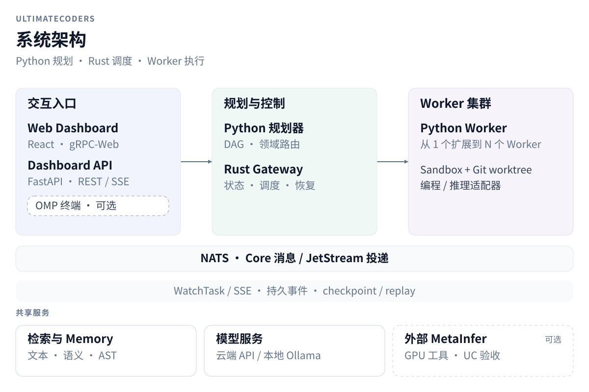

# UltimateCoders

[English](README.md) | [简体中文](README.zh-CN.md)

[](https://github.com/JameryW/UltimateCoders/actions/workflows/ci-rust.yml)
[](https://github.com/JameryW/UltimateCoders/actions/workflows/ci-python.yml)
[](#license)

UltimateCoders 是一个分布式 AI 编程系统，提供共享分层记忆，以及跨多个仓库的 Text、Semantic、AST 混合检索。

默认 Docker 应用由 Web Dashboard、Rust Gateway、NATS 和 Python Worker 组成。oh-my-pi（OMP）扩展作为可选的本机终端入口，通过 `run-omp.sh` 单独使用。Python Worker/Sandbox 默认使用 [xAI Grok Build](https://github.com/xai-org/grok-build) 编程 Agent（`grok`）执行子任务，也支持 Claude Code、Codex、OpenCode、oh-my-pi、MiMo Code 和本地 harness。Rust 核心负责索引、检索、记忆和调度，并向 Dashboard 和 API 消费者推送实时任务事件。

## 核心特性

- **DAG 任务编排**：将自然语言任务拆解为可观测节点，依赖完成后即可派发，并持续推送生命周期事件。
- **产品首页和运营 Dashboard**：`/` 展示产品能力和执行链；`#/dashboard` 提供任务、Worker、事件和调度视图。
- **可选 OMP 扩展**：`run-omp.sh` 在 Docker 应用之外提供本机 `/uc` 命令和 LLM 工具。
- **分布式 Worker**：Worker 通过 `WorkerService` 注册，发布心跳和能力声明，由 Gateway 按能力和负载调度；NATS 负责跨进程子任务分发。
- **Rust 核心**：Engine、Task、Dashboard、Worker 服务统一提供 gRPC/gRPC-Web 接口，支持任务恢复、事件广播和内存 fallback。
- **跨仓库混合检索**：一次查询可以组合 Text、Semantic 和 AST 检索，覆盖多个已索引 Git 仓库。
- **分层记忆**：短期记忆、长期语义记忆和结构化元数据分别使用 TiKV、Qdrant 和 PostgreSQL；依赖不可用时退回内存模式。
- **推理基础设施**：可选 MetaInfer 后端提供模型移植、Kernel/Runtime 工具和 Trace 分析；固定基准、Oracle 验收、迭代回滚和执行适配图将结果接入共享记忆。
- **灵活部署**：支持本机 OMP、Docker Gateway、Docker Compose 和多 Worker 集群；Worker 可使用 Grok Build、Claude Code、Codex、OpenCode、oh-my-pi、MiMo Code 或本地 harness。

## 产品特性

UltimateCoders 将终端里的 AI 编程变成可观测、可调度的执行平台：

| 能力 | 展示内容 | 用户收益 |
| --- | --- | --- |
| 产品首页 | Runtime Surface、执行链和典型场景 | 从一个入口理解产品并进入真实执行路径 |
| 产品分层图 | Command、Control、Execution、Knowledge、Event 五层 | 看清入口、编排、Worker、上下文和结果回流如何连接 |
| Dashboard 交互 | 提交任务、查看状态和实时事件 | 在浏览器中操作并观察执行 |
| DAG 编排 | 规划器构建 DAG，Rust Gateway 派发就绪节点 | 复杂任务可拆解、追踪和恢复 |
| 统一任务状态 | Dashboard 和 gRPC TaskService 使用同一份任务数据 | 状态与执行结果保持一致 |
| 分布式 Worker | 注册、能力声明、心跳和负载感知调度 | 围绕模型和工具能力扩展执行容量 |
| 检索与记忆 | Text + Semantic + AST 检索，以及 TiKV/Qdrant/PostgreSQL 记忆 | 为 Coding Agent 提供跨仓库可复用上下文 |
| 推理基础设施 | InfraAgent、MetaInfer 工具、Benchmark/Oracle 和执行适配图 | 依据测量结果验收优化，并保留可复用的工程证据 |
| 可靠部署 | Rust Gateway、NATS、Docker、内存 fallback 和任务事件 | 从本机工作流平滑扩展到 Worker 集群 |

## 快速开始

### 1. 安装依赖

- Rust 1.75+（stable）
- Python 3.9+
- Bun（仅可选 OMP 扩展需要）
- [Grok Build CLI](https://docs.x.ai/build/overview)（默认 Worker 执行器）
- Docker Compose（运行默认应用）

安装 Grok Build，并为默认 Worker 设置 xAI API key：

```bash
curl -fsSL https://x.ai/cli/install.sh | bash
export XAI_API_KEY=your-key
```

### 2. 启动 Docker 应用

```bash
git clone https://github.com/JameryW/UltimateCoders.git
cd UltimateCoders
docker compose -f docker/docker-compose.yml --profile app up --build
```

Compose 启动 Gateway、Dashboard API 和 UI、NATS、存储及 Worker。需要本机 OMP 扩展时，可另行运行 `./run-omp.sh`。

产品入口：

| 入口 | 用途 |
| --- | --- |
| `http://localhost:8081/` | 产品首页：能力总览和执行链 |
| `http://localhost:8081/#/dashboard` | 运营 Dashboard：任务、Worker、事件、调度、检索、文件和指标 |

可选 OMP 命令：

```text
/uc submit <description>    提交任务
/uc status                  查看任务状态
/uc pause <task-id>         暂停任务
/uc resume <task-id>        恢复任务
/uc cancel <task-id>        取消任务
```

### 3. 启动其他模式

```bash
# 分布式集群：NATS + gRPC + 多个 Worker，可选 OMP
./run-cluster.sh --workers 2

# 独立 Gateway：内存 fallback 或外部存储
./run-gateway.sh up

# Gateway + 本地存储容器
./run-gateway.sh up --docker
```

## 技术架构图

系统将任务规划、执行控制、编程执行和推理验收分开。默认 Compose 应用运行 Dashboard UI/API、Rust Gateway、Python 规划协调器、NATS 和可扩展 Worker Pool；本机 OMP 扩展是可选入口。



[完整概览图](docs/screenshots/architecture-overview.zh-CN.svg) · [手机竖版](docs/screenshots/architecture-overview-mobile.zh-CN.svg) · [通信协议与验收流程](docs/architecture.md#system-architecture)

三列概括交互入口、规划与控制、分布式执行；箭头概括任务流向，虚线边框标明可选集成。架构文档中的详细图展示各组件的通信协议和 UC 的推理验收流程。

默认任务链为 **提交 → 规划 DAG → 派发就绪节点 → 执行 → 上报 → 释放后继节点**。Python 负责规划和领域路由，Rust Gateway 负责任务控制与派发（Compose 设置 `UC_GATEWAY_OWNS_DISPATCH=true`）。节点完成后可以立即释放其后继，无需等待整个 wave。

| 层 | 组件 | 作用 |
| --- | --- | --- |
| Interaction | Web Dashboard、Dashboard API；可选本机 OMP | 提供浏览器 gRPC-Web、REST/SSE 和终端 `/uc` 入口 |
| Planning | Python 协调器；可选 OMP 规划器 | 拆解任务、校验依赖、路由推理任务并保留执行配置 |
| Control plane | Rust Gateway、TaskStore、WorkerRegistry | 管理任务状态、就绪节点派发、能力/项目/版本门禁、放置、控制与恢复 |
| Execution | NATS JetStream、Python Worker、Sandbox/worktree | 投递执行信封，运行编程适配器或推理工作流 |
| Knowledge | Search + Memory | 组合 Text、Semantic、AST 检索，以及 TiKV、Qdrant、PostgreSQL 分层记忆 |
| Acceptance | BenchmarkRunner、Oracle、优化工作流 | 测量固定工作负载，拒绝并回滚候选，保留已验收证据 |
| Observability | 任务事件、WatchTask、Dashboard API/SSE | 提供实时进度、有序持久历史、checkpoint/replay 和指标 |

Durable Runtime 设计以 Graph → Node → Attempt 标识、租约/fencing 和 commit-once 结果为基础。当前 Gateway 仍通过 TaskStore 投影提供任务视图；PostgreSQL Graph 写入及图上的 Attempt 操作需要配置 `UC_DATABASE_URL` 并启用 `UC_GRAPH_SHADOW=on`。默认 Compose 已配置 PostgreSQL 任务持久化和 NATS 事件历史，但未启用 Graph shadow。推理领域的**执行适配图**记录实验来源和证据，与用于调度的执行图是不同对象。

MetaInfer 是外部执行后端：UC 负责已分配 worktree、基准保护、Oracle 策略、取消和验收；GPU 分配及专业生成由服务负责。本地 Ollama 通过兼容的规划/编程适配器提供模型推理，MetaInfer 则提供专业工程工具。组件边界与部署模式见[架构说明](docs/architecture.md)。

## 推理基础设施（MetaInfer）

UltimateCoders 负责全局规划、调度、工作区归属和结果验收。可选的 `InferenceInfraAgent` 将专业执行交给外部 MetaInfer 服务。工具位于 `ultimate_coders.inference`，UC Worker 镜像不需要安装 MetaInfer 源码或 GPU 库。

| 操作 | 执行后端 | 用途 |
| --- | --- | --- |
| `port_model` | MetaInfer `port-model` | 将模型移植到已分配的框架工作区 |
| `optimize_kernel` | MetaInfer `evolve-kernel` | 生成并评估 Kernel 候选实现 |
| `optimize_runtime` | 默认 MetaInfer `gen-infer-framework` | 生成专用 Runtime；优化现有框架需要通过 `upstream_type` 选择合适的服务插件 |
| `analyze_trace` | MetaInfer `sglang-trace-analyze` | 收集运行时分析和证据 |
| `benchmark` | UC `BenchmarkRunner` | 在本机测量固定工作负载，无需 MetaInfer 服务 |

在规划器和参与执行的 Worker 上设置服务地址；使用 Compose 时可写入 `docker/.env`：

```dotenv
UC_METAINFER_URL=http://metainfer-host:8765
```

启用后，Worker 声明 `inference_infra` 及领域能力。自动路由同时要求推理上下文和工程任务意图，显式 Agent 选择优先。地址留空时不启用自动推理路由或相应能力声明。

通过 Dashboard 提交 API 或 Python Orchestrator 传入 `agent_config.inference_task`，也可在工作流步骤中选择 `metainfer` 适配器。服务任务需要实际插件参数；优化或本机测量任务还需要 benchmark 配置。自然语言不会自动补出模型路径或 GPU 可用性。可选的 `UC_INFERENCE_TASK_JSON` 为自然语言路由提供默认实验配置。

优化流程先测量基线，再请求候选实现，执行编译、基准和 profiling，通过公共 Oracle 检查正确性、性能及显存/数值误差上限。更好的实现保留，未通过的候选回滚后进入下一轮。使用 `protected_paths` 保护基准脚本；服务在独立工作区生成产物时，通过显式 argv `apply_command` 导入选中的实现。

UC 和 MetaInfer 必须以相同绝对路径访问已分配的工作区；优化任务需要独占、初始干净的 Git worktree，跨主机时需共享对应文件系统。Compose 使用 `worker_inference_artifacts` 卷将报告、基准历史、执行适配图和已接受补丁持久化到 `/artifacts/inference`；通过验收的结构化证据也会写入项目 Memory。

验证快照（2026-09-30）：生产 Docker 应用已在本地运行，并验证了真实 Ollama 分布式编码、通过固定 Oracle 的 GPU 对话基准、存储、任务控制和恢复。外部 MetaInfer 优化服务尚未配置。实际证据、复现命令和限制见[本地部署验证报告](docs/local-deployment-verification.md)。

完整任务示例、实时 schema 要求、基准输出、Oracle 策略及部署/取消边界见[推理基础设施指南](docs/inference-infra.md)。

## 产品预览

产品首页（`/`）解释产品能力和执行链；运营 Dashboard（`#/dashboard`）提供任务提交与监控。

### Dashboard 首页与实时入口

产品首页负责连接产品理解和真实执行：

- **Runtime Surface**：通过现有 gRPC-Web 连接显示 Gateway 状态、版本、任务数量和 WatchTask 状态。
- **执行链**：展示 `Dashboard → Rust Gateway → Worker → TaskEvent` 的主要阶段。
- **Product Map**：解释 Command、Control、Execution、Knowledge、Event 五个平面的职责、协议和收益。
- **实时操作**：进入 `#/dashboard` 提交任务并通过 gRPC-Web 查看状态和事件。

本地预览：`http://127.0.0.1:4176/`；运营 Dashboard：`http://127.0.0.1:4176/#/dashboard`。

### 产品能力总览


总览图展示 DAG 编排、能力感知 Worker、Hybrid Search + Memory、事件驱动恢复，以及从本机工作流到集群的部署路径。

### 产品场景


UltimateCoders 面向大型仓库改造、并行交付、线上问题诊断和从本机扩展到集群四类场景，核心收益是上下文可复用、执行可观测、容量可扩展。

## 运行时与架构细节

产品 Dashboard（Vite + React）在 Docker 应用中的默认地址是 `http://localhost:8081/`，开发模式为 `http://localhost:5173/`。根路由是产品首页，`/dashboard` 或 `#/dashboard` 提供运营与任务界面。

完整架构说明见 [docs/architecture.md](docs/architecture.md)。运行时可以分为五层：

| 层 | 职责 | 主要接口 |
| --- | --- | --- |
| Command | Dashboard UI/API 和可选本机 OMP | gRPC-Web、REST/SSE、`/uc` |
| Control | 规划协调器与 Rust 任务生命周期、就绪节点调度和持久化 | Orchestrator、TaskService、TaskStore、执行信封 |
| Execution | 能力感知 Worker、编程适配器和可选推理工作流 | WorkerService、NATS JetStream、Sandbox/worktree、MetaInfer HTTP |
| Knowledge | 仓库索引、混合检索和分层记忆 | Text、Semantic、AST、TiKV、Qdrant、PostgreSQL |
| Events | 实时进度、恢复和监控更新 | TaskEvent、有序 EventStore、checkpoint/replay、SSE、WatchTask |

### 实时事件流

1. 规划协调器发布完整 DAG/配置快照，Worker 通过 NATS 发布部分结果和进度；部分上报不能覆盖父任务控制状态或执行配置。
2. Gateway 在同一 TaskStore 锁内应用状态变更并记录事件，通过广播通道提供 `WatchTask`；Dashboard API 独立消费 NATS，提供 SSE 和指标。
3. EventStore 按记录顺序持久化事件。checkpoint/recovery 等待此前写入完成，再回放完整历史；写入失败会成为恢复错误。
4. Compose 使用 `UC_EVENT_BACKEND=nats` 提供持久 JetStream 历史。内存事件后端与 checkpoint 快照缓存是临时数据；持久事件历史支持重启后回放。

### OMP 扩展内部结构

UC Orchestrator 扩展（`packages/uc-orchestrator`）是可选的本机终端界面。它负责规划，也可 claim 未分配节点并在本机执行；任务控制和执行顺序通过 Rust Gateway 管理：

| 组件 | 文件 | 作用 |
| --- | --- | --- |
| **Extension entry** | `extension.ts` | 注册 `/uc` 命令、快捷键和消息渲染器，并连接事件与 UI |
| **Orchestrator** | `orchestrator.ts` | 规划/校验 DAG → 上报 Gateway → claim/执行/上报 → 观察完成 |
| **Scheduler** | `scheduler.ts` | DAG 校验、文件冲突辅助和 CircuitBreaker |
| **GrpcBridge** | `grpc-bridge.ts` | TaskService gRPC 客户端，负责提交、监听和控制信号 |
| **MemoryBridge** | `memory-bridge.ts` | LLM 工具 `uc_memory`，负责记忆读写、搜索和删除 |
| **TaskBridge** | `task-bridge.ts` | LLM 工具 `uc_task`，负责任务提交、取消、暂停、恢复和状态查询 |
| **IndexBridge** | `index-bridge.ts` | LLM 工具 `uc_index`，负责仓库索引管理 |
| **FileBridge** | `file-bridge.ts` | LLM 工具 `uc_file`，负责目录和文件读取 |
| **WorkerBridge** | `worker-bridge.ts` | LLM 工具 `uc_worker`，负责 Worker 查询、扩缩容和注销 |
| **TaskStore** | `task-store.ts` | 本地 JSON UI 投影缓存，从 Rust 任务状态刷新 |
| **ControlSignals** | `control-signal-subscriber.ts` | 接收外部暂停、恢复和取消信号的 gRPC 流 |
| **Events** | `events.ts` | 解耦编排逻辑与 UI 的类型化事件发射器 |

Agent 定义提示词（`agents/decomposer.md`、`supervisor.md`、`worker.md`）负责配置任务拆解、子任务审查和代码生成角色。

### 本地 fallback（无 NATS）

存储 fallback 与执行 fallback 有不同契约。Gateway 可以使用内存存储提供 API，但这并不提供编程执行器。Executor selector 仅允许配置了本地 handler 的 `read_only`/`local_safe` 节点本地执行；编程节点需要具备相应能力的执行器，传输或容量不可用时保持排队。可选 OMP claim loop 可以在本机执行已认领节点并向 Gateway 上报。没有规划器或执行器的独立 Gateway 不会自动拆解并完成编程任务。

### NATS Worker

同一个 Python 模块提供两种部署角色：

| Compose 服务 | 模式 | 职责 |
| --- | --- | --- |
| `nats-worker` | 默认协调器模式 | 订阅 `uc.task.submit`，调用 Orchestrator 规划/领域路由并发布完整任务快照；Compose 将派发交给 Rust |
| `worker` | `--mode worker` | 通过 WorkerService 注册/心跳，消费 JetStream 执行信封，运行 Worker/Sandbox 适配器并发布部分结果/事件 |

Worker 仅声明可用能力，并携带与 Gateway 对齐的契约版本。版本不匹配会被拒绝；能力、项目范围或当前版本的可用容量不足时，节点保持 Pending。规划模型配置与编程适配器选择相互独立。

Worker 默认执行 `grok -p ... --output-format streaming-json`。如果部署需要兼容适配器，可设置 `UC_CODING_AGENT=claude-code` 或 `UC_CODING_AGENT=codex`。

### 多 Worker 分布式执行

多个 Worker 进程执行同一 DAG 中相互独立的就绪节点：

- **持久投递**：Gateway 创建 `UC_SUBTASKS` JetStream 流，消费者确认 Attempt 并支持重投递。投递本身不保证 exactly-once；执行信封包含 Graph/Node/Attempt ID、幂等键、Worker epoch 和契约版本。
- **放置策略**：能力、项目范围和契约版本是硬门禁。默认 affinity 优先考虑近期文件重叠；可选 `UC_PLACEMENT_POLICY=capacity` 按负载/容量排序合格的专属 Worker，共享投递保留为 overflow。
- **Attempt 安全**：启用的 PostgreSQL Graph 路径认领/续租、fence 过期 Attempt，并只提交一次终态结果；迟到结果不能覆盖已提交的完成事实。
- **冲突处理**：文件重叠提示减少碰撞；可选外部 Git 模式使用隔离 worktree 和合并时仲裁，图上的 merge barrier 由 Rust 签发 fenced 授权。
- **事件驱动调度**：已接受结果经 Gateway 释放后继节点；暂停/恢复/取消遵循同一控制权威。显式 review 需要启用 `review` 能力的 Worker 和结构化裁决；共享 overflow 不保证严格独立投递。

### 仓库结构

| 路径 | 用途 |
| --- | --- |
| `crates/` | Rust 核心、Engine API、gRPC 服务和 PyO3 绑定 |
| `packages/uc-orchestrator/` | OMP 扩展、DAG 编排、UC 工具和终端 UI |
| `python/ultimate_coders/` | Python Engine facade、Worker/Sandbox、检索、记忆和 FastAPI Dashboard |
| `python/ultimate_coders/inference/` | MetaInfer 适配器、InfraAgent 路由、基准、Oracle、优化工作流及执行适配图 |
| `dashboard/` | Vite + React 产品首页和运营 Dashboard |
| `docker/` | Gateway、Worker、存储和 compose 配置 |
| `tests/python/` | Python 单元测试 |
| `run-omp.sh`、`run-cluster.sh`、`run-gateway.sh` | 本机、集群和独立部署入口 |

## 构建

### Rust

```bash
cargo check                    # 检查所有 crate 编译
cargo test                     # 运行测试（内存 fallback）
cargo test --features storage  # 使用真实存储后端运行测试
cargo test --features indexing # 启用 AST 索引运行测试
cargo clippy --workspace       # 代码检查
cargo fmt --all -- --check     # 格式检查
```

`uc-grpc-server` 网关默认启用调度器运行时，因此标准启动脚本和
Docker 构建会实际执行 `uc.scheduler.yaml` 中声明的 cron/一次性任务。
底层 `uc-engine` 库仍保持 scheduler feature 可选，供不需要运行时调度的
调用方使用。

### Python

```bash
python -m pip install -e ".[test]"
pytest tests/python/ -v
```

### UC Orchestrator

```bash
# 启动 OMP + UC 扩展（默认启动 gRPC server）
./run-omp.sh

# 跳过 gRPC server
./run-omp.sh --no-server

# 首次运行前构建 Python 包
./run-omp.sh --build

# 独立模式：Gateway 运行在容器中
./run-omp.sh --standalone
./run-omp.sh --standalone --docker

# 启动分布式集群
./run-cluster.sh
./run-cluster.sh --standalone --workers 2
```

### 独立 Gateway（容器化）

```bash
./run-gateway.sh up
./run-gateway.sh up --docker
./run-gateway.sh status
./run-gateway.sh logs
./run-gateway.sh down [--docker]

# 外部存储：空值表示使用内存 fallback
# UC_TIKV_PD_ENDPOINTS=pd.example:2379 UC_QDRANT_URL=http://qdrant.example:6334 \
#   UC_PG_URL=postgresql://u:p@pg.example:5432/uc UC_NATS_URL=nats://nats.example:4222 \
#   ./run-gateway.sh up
```

### Docker Compose（存储后端）

```bash
# 构建并启动完整本地应用（包含 React Dashboard UI）
docker compose -f docker/docker-compose.yml --profile app up --build
# React UI：http://localhost:8081
# Dashboard API：http://localhost:8080/dashboard/

docker compose -f docker/docker-compose.yml up -d
docker compose -f docker/docker-compose.yml down
docker compose -f docker/docker-compose.yml down -v
```

### 分布式 Worker 与外部 Git 部署

Worker 可以在容器中运行，并从外部 Git remote（GitHub/GitLab）同步代码，让 remote 成为多主机之间的统一事实来源。该功能默认关闭；未设置 `UC_REPO_URL` 时使用传统本地 workspace 模式。

| 变量 | 默认值 | 说明 |
| --- | --- | --- |
| `UC_REPO_URL` | _(empty)_ | 外部 Git remote；为空表示本地模式 |
| `UC_REPO_BASE_BRANCH` | `main` | Worker 分支的基线，arbiter 合并到此分支 |
| `UC_GIT_TOKEN` | _(empty)_ | 通过 `GIT_ASKPASS` 注入的 PAT，不写入 URL 或参数 |
| `UC_GIT_FETCH_ON_ACQUIRE` | `true` | 每次获取 worktree 前执行 `git fetch` |
| `UC_GIT_PUSH_ON_RELEASE` | `false` | release 时推送 `uc/subtask/<id>` 分支 |
| `UC_GIT_MERGE_ARBITRATE` | _(env)_ | 启用 MergeArbiter，将子任务分支合并并推送到 `origin/main` |

执行流程：

1. Worker 首次启动时将 `UC_REPO_URL` clone 到持久卷。
2. 每个子任务在从 `origin/<base_branch>` 创建的 git worktree 中执行。
3. release 时推送 `uc/subtask/<id>`，Worker 不直接修改 `main`。
4. Orchestrator 的 MergeArbiter 将子任务分支合并到 `origin/main` 并推送 `main`。

`DistributedConflictDetector` 只是进程内调度提示，不是分布式锁。跨 Worker 的权威冲突点在 Git merge-time（`MergeArbiter`）。`docker compose --scale worker=N` 只扩展同一主机上的 Worker；跨主机部署需要 Docker Swarm、远程 Docker context 或按主机部署 Gateway。

## CI

面向 `main` 的推送与 PR 会运行十套独立工作流。除 `ci-scripts.yml` 外都是路径过滤的 —— 只有列出的路径发生变化才会运行；工作流文件本身是权威来源：

| 工作流 | 触发路径 | 检查内容 |
| --- | --- | --- |
| **Rust CI**（`ci-rust.yml`） | `crates/**`、`Cargo.toml`、`Cargo.lock`、`docker/docker-compose.yml` | check、clippy、fmt，3 组 feature 测试，postgres 集成测试 |
| **Python CI**（`ci-python.yml`） | `python/**`、`tests/**`、`pyproject.toml`、`dashboard/**`、`crates/uc-python/**`、`crates/uc-types/**`、`crates/uc-engine/**`、`crates/uc-grpc/**`、`Cargo.toml`、`Cargo.lock` | ruff lint、dashboard 构建、pytest（Python 3.9 + 3.12） |
| **Dashboard CI**（`ci-dashboard.yml`） | `dashboard/**` | typecheck、build |
| **TypeScript CI**（`ci-typescript.yml`） | `packages/uc-orchestrator/**`、`vendor/oh-my-pi/packages/mnemopi/**`、`vendor/oh-my-pi/packages/coding-agent/**` | 每个包的 `bun test` |
| **Scripts CI**（`ci-scripts.yml`） | *（无 paths 过滤）* | spec-refs、tasks-refs、ruff lint |
| **Trellis CI**（`ci-trellis.yml`） | `.trellis/scripts/**`、`tests/python/test_task_finish_fallback.py`、`tests/python/test_archive_repoints_refs.py` | framework-scripts 测试 |
| **Journal CI**（`ci-journal.yml`） | `.trellis/workspace/**`、`.trellis/scripts/add_session.py`、`scripts/check-journal-ledger.py`、`tests/python/test_check_journal_ledger.py` | journal ledger 检查与测试 |
| **Codex Issue-Flow CI**（`ci-codex-flow.yml`） | `.agents/skills/**`、`AGENTS.md`、`docs/agents/domain.md`、`docs/agents/issue-tracker.md`、`docs/agents/mattpocock-skills.md`、`docs/agents/triage-labels.md`、`docs/workflows/codex-issue-flow.md`、`scripts/check-codex-issue-flow.py` | issue 工作流接线校验 |
| **README CI Table CI**（`ci-readme-ci-table.yml`） | `README.md`、`README.zh-CN.md`、`.github/workflows/**`、`scripts/check-readme-ci-table.py`、`tests/python/test_check_readme_ci_table.py` | 把本表与 workflow YAML 对账 |
| **Workflow Inputs CI**（`ci-workflow-inputs.yml`） | `.github/workflows/**`、`scripts/check-workflow-inputs.py`、`tests/python/test_check_workflow_inputs.py` | 校验 workflow 的 `run:` 步点名的每个文件都被它的 `paths` 覆盖 |

上述带路径过滤的工作流都会让自己的 YAML 文件命中 `paths`（直接列出，或经 `.github/workflows/**`），因此改动工作流本身会重新触发它；所有工作流都支持手动触发。PostgreSQL 集成测试在每个 PR 上运行；存储集成测试只在推送到 `main` 或手动触发时运行，并需要 Docker Compose 基础设施。

## 配置

配置通过环境变量加载，开发时不需要配置文件：

| 变量 | 默认值 | 说明 |
| --- | --- | --- |
| `UC_ENGINE_MODE` | `local` | Engine 模式：`local`（PyO3 FFI）或 `grpc`（远程） |
| `UC_GRPC_ADDR` | `[::]:50051` | gRPC server 监听地址 |
| `UC_GRPC_ENDPOINT` | - | gRPC endpoint，grpc 模式必填 |
| `UC_TIKV_PD_ENDPOINTS` | `127.0.0.1:2379` | TiKV PD 地址，逗号分隔 |
| `UC_QDRANT_URL` | `http://127.0.0.1:6333` | Qdrant REST API 地址 |
| `UC_QDRANT_API_KEY` | - | 可选的 Qdrant API key |
| `UC_POSTGRES_URL` | `postgresql://localhost:5432/ultimatecoders` | PostgreSQL 连接 URL |
| `UC_NATS_URL` | `nats://127.0.0.1:4222` | NATS server URL |
| `UC_PROJECT_PATH` | - | Sandbox 执行时的项目路径 |
| `UC_CODING_AGENT` | `grok-build` | Worker coding agent：`grok-build`/`grok`、`claude-code`、`codex`、`opencode`、`oh-my-pi`/`omp`、`mimo-code`/`mimo`、`deepseek-harness` 或 `local-harness` |
| `UC_METAINFER_URL` | 空 | 可选外部 MetaInfer 服务，启用推理能力声明和自动领域路由 |
| `UC_INFERENCE_TASK_JSON` | 空 | JSON `agent_config`，为推理实验和自然语言路由提供默认配置 |
| `UC_INFERENCE_ARTIFACT_DIR` | 已分配仓库旁的 `.uc-inference-artifacts` | 本机实验产物根目录；Compose 使用持久卷中的 `/artifacts/inference` |
| `XAI_API_KEY` | - | 默认 Grok Build Worker 使用的 xAI API key |
| `ANTHROPIC_API_KEY` | - | Claude Code 使用的 Anthropic API key |
| `OPENAI_API_KEY` | - | Codex 使用的 OpenAI API key |
| `UC_CODEX_OPENROUTER` | `false` | 启用 Codex CLI 的 OpenRouter provider（需同时设置 `UC_CODING_AGENT=codex`） |
| `UC_OPENROUTER_MODEL` | `stealth/ox-alpha` | opt-in Codex provider 使用的 OpenRouter 模型 slug |
| `UC_CODEX_WEB_SEARCH` | `disabled` | Codex 原生 web-search 模式；`stealth/ox-alpha` 会拒绝该 OpenAI 专属工具，应保持禁用 |
| `UC_OPENROUTER_REASONING_EFFORT` | `low` | Codex 推理强度；`stealth/ox-alpha` 要求启用 reasoning |
| `OPENROUTER_API_KEY` | - | opt-in Codex provider 使用的 OpenRouter API key |
| `UC_SANDBOX_ENV_EXTRA` | - | 额外透传给 agent 子进程的环境变量，逗号分隔（`*` 后缀 = 前缀匹配）。agent 子进程采用 deny-by-default 白名单——仅基础系统变量、`UC_*`、代理变量与上表所列各 agent 凭据会从宿主环境继承。用该变量放宽白名单，启动时会记录日志。 |

Docker Compose 默认凭据：

| 服务 | Host | Port | 用户 | 密码 |
| --- | --- | --- | --- | --- |
| PostgreSQL | localhost | 5432 | `ultimate_coders` | `ultimate_coders` |
| Qdrant REST | localhost | 6333 | - | - |
| Qdrant gRPC | localhost | 6334 | - | - |
| TiKV PD | localhost | 2379 | - | - |
| NATS | localhost | 4222 | - | - |
| NATS Monitor | localhost | 8222 | - | - |

## 开发

### 运行测试

```bash
# Rust 单元测试（不需要存储）
cargo test --no-default-features

# 启用索引功能
cargo test --features indexing

# 使用真实存储（需要 Docker Compose）
cargo test --features storage

# Python 测试
python -m pip install -e ".[test]"
pytest tests/python/ -v

# UC Orchestrator 测试
cd packages/uc-orchestrator && npx tsc --noEmit
```

### Lint

```bash
# Rust
cargo clippy --workspace -- -D warnings
cargo fmt --all -- --check

# Python
ruff check python/ tests/ scripts/

# UC Orchestrator
cd packages/uc-orchestrator && npx tsc --noEmit
```

## License

MIT
