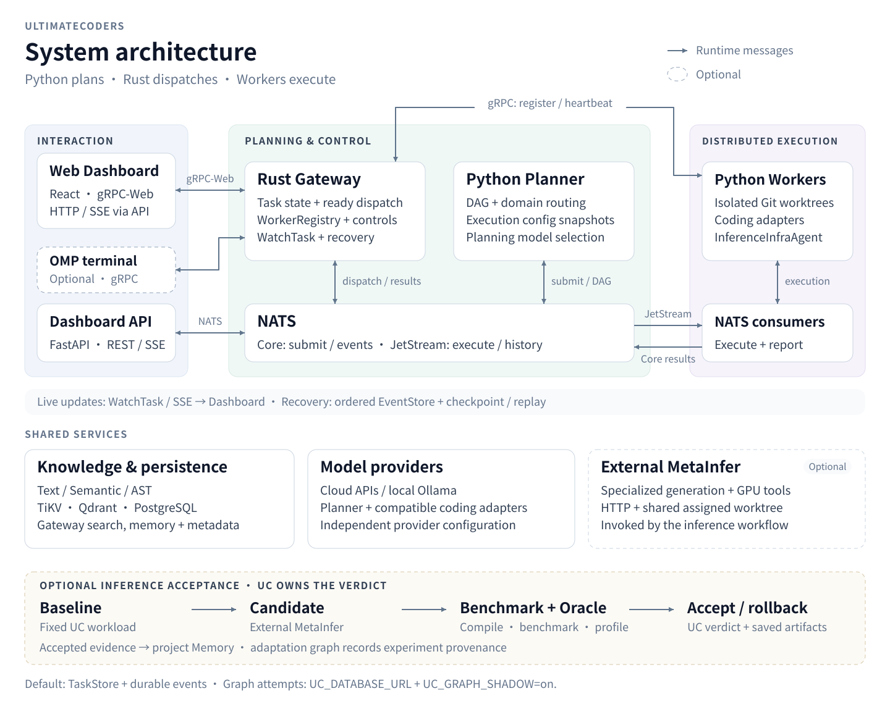

# UltimateCoders Architecture

UltimateCoders separates planning from execution authority. The Web Dashboard is the default interface, with a Dashboard API for REST/SSE and an optional native OMP extension. Python plans task DAGs and routes domains; Rust owns task controls, ready-node dispatch and the graph-backed attempt protocol. Workers execute coding adapters or inference workflows in assigned worktrees.

## System architecture

[Open the full-size diagram](screenshots/system-architecture.svg) or [the Chinese version](screenshots/system-architecture.zh-CN.svg). The three columns show entry points, planning/control, and distributed execution. Arrows represent runtime messages; dashed outlines mark optional integrations. Shared-service access is described within each card, while the lower workflow shows UC's inference acceptance boundary.

The README uses a [compact overview](screenshots/architecture-overview.svg), also available in [a mobile layout](screenshots/architecture-overview-mobile.svg). The overview summarizes responsibilities and task flow; the service diagram above shows protocol routes and acceptance boundaries.

All views are generated in English and Chinese by [the architecture generator](../scripts/generate-architecture.py), with a shared layout for each language pair. Run `python scripts/generate-architecture.py` to regenerate the six SVGs, or add `--check` to verify the checked-in outputs. The source SVGs contain selectable text and accessible descriptions; no browser scripts or remote assets are required.

## Component ownership

| Layer | Main components | Responsibility |
| --- | --- | --- |
| Interaction | React Dashboard, FastAPI Dashboard API, optional OMP | Browser gRPC-Web, REST/SSE, and terminal task entry/control |
| Planning | Python Orchestrator coordinator, optional OMP planner | Decompose/validate the DAG, select domain adapters, publish complete execution configuration |
| Control | Rust Gateway: TaskService, EngineService, DashboardService, WorkerService | TaskStore projection, ready-node scheduling, WorkerRegistry gates/placement, controls and recovery |
| Execution | NATS JetStream, Python Worker/Sandbox, coding adapters | Durable delivery, execution envelopes, isolated worktrees, progress/results |
| Acceptance | InferenceInfraAgent, MetaInferAdapter, BenchmarkRunner, Oracle, OptimizationWorkflow | Baselines, protected benchmarks, candidate acceptance/rollback and evidence |
| Knowledge | Rust hybrid index and layered Memory; TiKV, Qdrant, PostgreSQL | Text/Semantic/AST retrieval, project context, memory and structured metadata |
| Events | NATS controls/results, Gateway EventStore/broadcast, WatchTask, API SSE/metrics | Live updates, ordered history and checkpoint/replay |

The Dashboard root `/` is the product overview; `/dashboard` and `#/dashboard` are operations routes. Docker serves the UI on port 8081, the API on 8080 and gRPC/gRPC-Web on 50051. The Compose service named `orchestrator` runs the **Dashboard API**. The separate `nats-worker` service runs the **planning coordinator**; `worker` replicas use `--mode worker` for execution.

## End-to-end task flow

1. Dashboard gRPC-Web submits to TaskService, or Dashboard REST publishes through NATS. The optional OMP planner can also upsert a validated DAG through gRPC.
2. The Python coordinator consumes `uc.task.submit`, plans/validates dependencies and routes explicit inference tasks. Complete snapshots retain agent configuration, capabilities, file constraints, expected output and workflow steps.
3. The Rust Gateway receives the DAG. Default Compose sets `UC_GATEWAY_OWNS_DISPATCH=true`, so the coordinator does not also schedule these nodes locally.
4. The Gateway dispatches each pending node whose dependencies completed, subject to capability, project scope and contract-version gates. Placement defaults to file affinity; optional capacity placement ranks eligible dedicated workers by current load/capacity, retaining shared overflow.
5. Gateway-provisioned `UC_SUBTASKS` JetStream consumers deliver execution envelopes. Workers register and heartbeat through WorkerService, run the selected Sandbox adapter in a worktree, and obtain repository context through EngineService.
6. Workers publish partial results/progress over NATS. Partial updates cannot overwrite parent control status or execution configuration. A completed node can release its dependents immediately; there is no global wave completion barrier.
7. The Gateway updates TaskStore and records lifecycle events under the same lock, then broadcasts through WatchTask. The Dashboard API separately consumes NATS for SSE and metrics.
8. EventStore appends preserve recording order; checkpoint/recovery waits for earlier writes and replays the complete recorded backlog. Failed durable writes produce recovery errors. Pause/resume/cancel and late-result handling share the Gateway control boundary.

## Durable Runtime design and current activation

The design models **ExecutionGraph → Node → Attempt**, with lease renewal, worker epoch fencing, idempotency keys and commit-once terminal results. Rust controls graph transitions; Python executors report outcomes. Delivery can repeat: queue acknowledgement and stream deduplication do not by themselves provide exactly-once execution.

The startup wiring currently has two levels:

| Configuration | Active behavior |
| --- | --- |
| Default Compose: `UC_TASK_BACKEND=postgres`, `UC_EVENT_BACKEND=nats` | TaskStore serves task state; PostgreSQL stores task metadata and JetStream retains event history |
| `UC_DATABASE_URL` with storage support | Initialize PostgreSQL graph tables and perform idempotent source backfill |
| Add `UC_GRAPH_SHADOW=on` | Wire graph writes and graph-backed attempt/lease/fencing/commit operations alongside the TaskStore projection |
| Storage fallback | In-memory task/event data is transient; it does not supply a coding executor |

Default Compose supplies the database URL but does not enable graph shadow mode. Full graph-only task authority is the migration direction; it must not be inferred from database availability alone. The OMP local JSON task files are UI projection caches, with controls issued through Rust.

The executor selector permits local fallback only for `read_only`/`local_safe` nodes with an installed local handler. Coding work needs a capable executor and queues on transport/capacity loss. The optional OMP claim loop can execute claimed nodes locally and report through Rust. A standalone Gateway without a planner/executor does not automatically perform coding tasks.

Explicit review nodes require the opt-in `review` capability and a structured JSON verdict. Shared overflow does not guarantee reviewer independence. Runtime diagnostics read persisted history and report missing measurements; they do not autonomously tune execution or implement monetary worker auctions.

## Inference infrastructure and model backends

`InferenceInfraAgent` is an optional engineering domain. Enabling `UC_METAINFER_URL` on the planner and eligible Workers activates routing and inference capability advertising. The `metainfer` coding-adapter slot launches the UC inference runner; the HTTP adapter delegates specialized generation/analysis to an **external MetaInfer service**. UC does not vendor the service or require its GPU libraries in the Worker image.

Optimization follows **fixed baseline → candidate generation/import → compile/benchmark/profile → Oracle verdict → accept or rollback**. UC owns clean assigned worktrees, protected benchmark files, Oracle policy, cancellation and rollback. MetaInfer owns specialized execution and GPU allocation; both sides must access the assigned workspace at the same absolute path. Runtime generation is not automatically optimization of an existing framework: the latter needs a suitable service plugin.

Reports, benchmark history, accepted patches and **execution/adaptation graphs** persist outside the candidate tree, in the Compose inference-artifact volume. Accepted structured evidence is published to project Memory through the Worker. This adaptation graph records experiment provenance; it is distinct from the durable execution graph that schedules nodes. Backend success alone is not correctness or performance evidence.

Planning models and coding adapters are configured independently. Ollama can supply a local OpenAI-compatible model endpoint to supported adapters; it does not replace the MetaInfer service. Local `BenchmarkRunner` measurements can run without MetaInfer. See [the inference guide](inference-infra.md) and [local verification evidence](local-deployment-verification.md) for executable examples and measured boundaries.

## Deployment modes

| Mode | Components and boundary |
| --- | --- |
| Default Compose app | Dashboard UI/API + Rust Gateway + Python planning coordinator + NATS + Worker replicas + local storage |
| Native terminal | Optional OMP planner/claim loop connected to Rust; storage and worker services depend on configuration |
| Standalone Gateway | Rust APIs with in-memory/external storage; attach a planner and executor for coding |
| Distributed workers | Gateway/coordinator plus remote Worker hosts, reachable NATS/gRPC endpoints and opt-in external Git sync |
| Inference domain | Eligible Worker + external MetaInfer, shared assigned workspace and persistent UC artifact storage |

File-overlap detection is advisory; authoritative cross-worker reconciliation happens at Git merge time. External Git push/merge is opt-in. With graph-backed arbitration, Rust grants the fenced merge barrier and Python MergeArbiter performs the merge. Worker/Gateway contract versions must align; follow the root README's deployment instructions when upgrading.

See [the README](../README.md) for runnable commands and configuration, [the runtime policy](architecture/durable-runtime-p2-policy.md) for diagnostics/review/placement boundaries, and [the migration assessment](architecture/durable-runtime-migration-assessment.md) for the original design decisions and delivery history.
